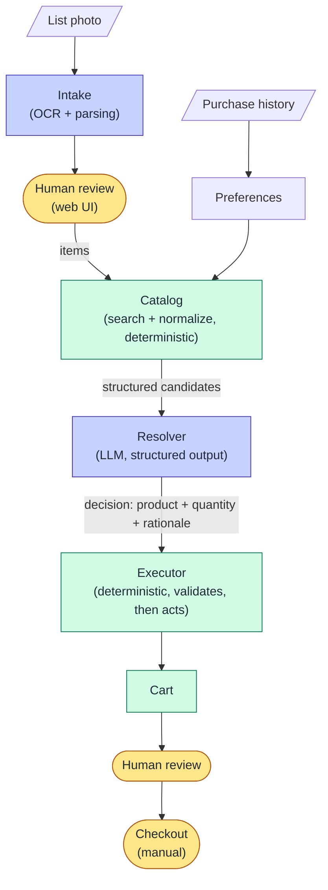

# Shopping Minion

An agent that turns a handwritten grocery list into a ready-to-review online shopping cart.

You take a photo of the list stuck to the fridge. Shopping Minion reads it, figures out which catalog product each line actually means (based on your purchase history and preferences), works out the right quantity for each product's unit of sale, and fills the cart. It stops before checkout: **a human always reviews and places the order.**

> Status: **v0 in progress.** This repo is built in the open; the reasoning behind each decision lives in [`docs/`](docs/).

## Why this is harder than it looks

"Leite" on a piece of paper is not a product. Turning it into the right item in the cart means solving several problems:

- **Perception:** handwriting in, structured items out.
- **Intent resolution:** a search returns 17 kinds of milk. Which one did the person mean?
- **Preferences:** the answer usually lives in purchase history (brand, size, recurring quantity), not in the list.
- **Units of sale:** some items are sold per unit, some per pack, and some by weight through +/- steppers (e.g., +500 g per click). "1 kg of ground beef" has to become the right number of clicks.
- **Safe execution:** an LLM should never have unchecked write access to a shopping cart.

## How it works



<sub>🟨 human step · 🟦 LLM · 🟩 deterministic code</sub>

**Design principles**

1. **Retrieval is deterministic; reasoning is the model's job.** The catalog layer searches the store and returns clean, structured candidates. The model never browses the site.
2. **The model decides; it does not act.** The resolver emits a structured decision. The executor validates it against product rules (unit of sale, stock, quantity bounds) before touching the cart. See [ADR-0005](docs/adr/0005-model-decides-executor-acts.md).
3. **Humans at the two points where errors hide.** The transcribed list is reviewed before anything is searched ([ADR-0002](docs/adr/0002-human-review-of-transcribed-list.md)), and nothing is ever purchased automatically.
4. **Store-agnostic core.** Store-specific code lives behind a catalog adapter ([ADR-0004](docs/adr/0004-store-catalog-adapters.md)). The first adapter targets one supermarket in São Paulo.

## Repository layout

```
docs/adr/        Architecture Decision Records
docs/journal/    Build log: what I tried, what I rejected, and why
src/             Source code (added as components land)
evals/           Evaluation fixtures (first real list in evals/fixtures/) and harness (planned)
data/            Local personal data: history, preferences. Never committed.
```

## Secrets and personal data

- Secrets are managed with [dotenvx](https://dotenvx.com) ([ADR-0001](docs/adr/0001-secrets-with-dotenvx.md)): `.env` is committed **encrypted**; the decryption key (`.env.keys`) is never committed.
- Browser session state, purchase history, and anything under `data/` stay local and are git-ignored.
- Evaluation fixtures are anonymized before they enter the repo.

## Roadmap

- [ ] v0: list photo → human review → structured items → one resolved product → item added to the cart
- [ ] v0: full list → full cart, stopping before checkout
- [ ] Preferences generated from purchase history (v0 uses a hand-written YAML, [ADR-0003](docs/adr/0003-preferences-as-static-yaml.md))
- [ ] Evaluation harness (product match, quantity/unit accuracy, human correction rate)
- [ ] Decision rationale shown to the user at review time

## License

MIT
