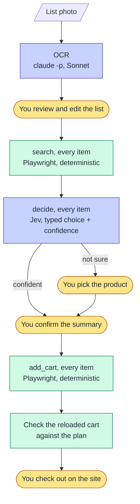

<p align="center">
  <picture>
    <source media="(prefers-color-scheme: dark)" srcset="docs/assets/minion-dark.svg">
    
  </picture>
</p>

# Shopping Minion

Turns a photo of a handwritten grocery list into a ready-to-review cart at [Andorinha](https://andorinhaonline.com.br), a supermarket in São Paulo.

You take a photo of the list on the fridge. Shopping Minion reads it, you fix what it misread, it searches the store for every item, picks a product for each one, and fills the cart. **It stops before checkout: a human always reviews and places the order.** The point is to save time on long lists (50+ items).

> **Status (2026-10-03): works end to end, in a web app on the desktop or the phone.** A real 90-item list, read from 3 photos, reached a checked cart in 22 minutes, 12 of them the person's. Jev picked 55 products on its own without a wrong one. The first real run took a 34-item list photo to 31 products in the real cart, each one checked against the reloaded cart. A measured 32-item run took 8 minutes from photo to checked cart, against over an hour by hand ([M3](docs/lld-m3.md#5-acceptance-t11)).
>
> This is the second version. The first one grew too many layers to reach a working cart and is archived in [`alfa0/`](alfa0/). [Why it was reset](docs/project-reset.md) · [what carried over](docs/lessons-learned.md) · [the journey](docs/journal/).

## How it works

Three passes over the whole list, each one finished before the next starts:



<sub>🟨 you · 🟦 model · 🟩 deterministic code</sub>

- **OCR:** `claude -p` with Sonnet and a [versioned prompt](src/shopping_minion/prompts/intake.md). It splits "atum / leite" into two items but keeps "feijão normal / preto não" as one item with constraints. The output is a YAML file you edit.
- **search:** opens `/busca/<term>` in a visible Chromium window and reads the first ~15 products from the JSON the page itself receives: name, brand, price, discount, unit or kg, stepper increment, stock.
- **decide:** [Jev](https://docs.typesafe.ai/introduction), TypeSafe's "System One" decision model, answers one typed Choice per item (the candidates plus "none of these"), five items per call, with a calibrated confidence. Above the threshold the pick is taken. Below it, the terminal shows the candidates with Jev's pick first and you choose.
- **quantity:** a rule, not a model: the list's quantity, else the preferences file, else 1 unit flagged. Code converts it into clicks; 1 kg of chicken at 100 g per click is 10 clicks.
- **add_cart:** opens each product page and clicks "Adicionar" and `+`. An item counts as added only after the page's own cart update comes back from the server, not when the number on screen changes ([why](docs/site-notes/andorinha.md#cart-sync-logged-in-seen-on-2026-10-01)). A product already in the cart is left untouched.
- **check:** the cart is read from the reloaded site before and after. Every planned product is checked by name and quantity, and anything else in the cart is flagged as not from this list.

**Rules the code keeps**

1. **The store is used only through its site, in a browser, the way a person would.** No HTTP client, no hand-built requests, no copied hosts or ids.
2. **Models decide; code acts.** No model drives the browser or writes to the cart.
3. **Checkout is always manual.** No code path places an order, and a test greps for it.
4. **Complexity has to be earned.** One store, code written for that store, no generic layers until a second case exists.

## Getting started

Needs [Claude Code](https://claude.com/claude-code) logged in (the OCR runs `claude -p` on your subscription) and a [TypeSafe](https://docs.typesafe.ai/introduction) API key for Jev. No Docker.

### Quickstart

```bash
curl -fsSL https://raw.githubusercontent.com/jwjosefy/shopping-minion/main/scripts/bootstrap.sh | bash
cd shopping-minion
just jev                          # asks for your TYPESAFE_API_KEY (hidden), saves it encrypted in .env.local
just login                        # log in to the store by hand once; the session goes to .auth/
just up                           # the web app; prints a URL + QR for the phone
just report                       # time and corrections for the latest run (`just report 7` for another)
just history-sync                 # read your last orders from the store (also runs at the start of every run)
```

[`scripts/bootstrap.sh`](scripts/bootstrap.sh) installs [uv](https://docs.astral.sh/uv/), [just](https://just.systems) and [dotenvx](https://dotenvx.com) into `~/.local/bin` when missing (no sudo), clones the repo, and installs the Python deps and Playwright's Chromium. It's safe to run again, also from inside a clone. `just up` uses `.env.local` if it exists and the project's `.env` otherwise, and stops if a secret doesn't decrypt.

### By hand

```bash
uv sync
uv run playwright install chromium   # Playwright's pinned Chromium, never the system Chrome
uv run pytest                        # offline; add `-m live` for tests that open the real site
```

```bash
uv run shopping-minion login                                  # log in by hand once; the session goes to .auth/
dotenvx run -- uv run shopping-minion serve                   # the web app (what `just up` runs)
uv run shopping-minion ocr photo.jpg -o data/lista.yaml       # read the list; then edit the YAML
dotenvx run -- uv run shopping-minion run data/lista.yaml     # search, decide, add, check
uv run shopping-minion report                                 # time and corrections for the latest run
```

`serve` listens on the LAN with a random token, and shows the same QR on the desktop page. Without the token, other machines get 401. `--local` keeps it on this machine. From the terminal, `run` does the same flow: it asks before touching the cart and leaves the browser open on it at the end. Preferences (brand, size, usual quantity) go in `data/preferencias.yaml`, with field names in Portuguese. See [`config/preferencias.exemplo.yaml`](config/preferencias.exemplo.yaml). Confidence thresholds and the Jev batch size are in [`config/decide.yaml`](config/decide.yaml).

### Evals

```bash
uv run python evals/intake_eval.py --photo <list photo> --model sonnet       # OCR vs evals/fixtures/list-001.yaml
dotenvx run -- uv run python evals/decide_eval.py --preferences <file>        # Jev on the 7 recorded cases
uv run python evals/confidence_report.py                                     # Jev's confidence percentiles over every saved run
uv run python evals/history_eval.py --run <n> --live-only                    # hit rate of a run, with and without history
```

On 2026-10-01, one run each:
- **OCR:** Sonnet found 31/32 items in 22 s; Haiku found 26/32 in 160 s.
- **Jev with test preferences:** 0 wrong products would be added, and 6/7 raw picks were right.

## Repository layout

```
src/shopping_minion/   one module per step: intake, search, decide, quantity, cart, reconcile, run
config/                Jev settings and the example preferences
evals/                 OCR and Jev evals with their ground truth
tests/                 offline tests; `live` ones open the real site
docs/hld.md            design (approved)
docs/lld.md            tasks for M0–M1, and what changed while building them
docs/site-notes/       what was observed on the store's site
docs/journal/          build log: what I tried, what broke, and why (feeds the blog)
alfa0/                 the first implementation, archived
data/                  local only, never committed: preferences, run history (SQLite), lists
```

## Secrets and personal data

- `.env` is committed **encrypted**. The private key stays in the OS keyring and is never committed.
- The browser session (`.auth/`), list photos (`inbox/`) and everything under `data/` stay local and are git-ignored.

### Working on it with someone else

The key to `.env` is never shared: it opens every secret in it, including in old commits. A collaborator brings their own:
- **Own secrets:** `just jev` puts their `TYPESAFE_API_KEY` in `.env.local` (git-ignored), with the private key in their OS keyring. The code needs nothing else. Then `just up` works the same for both.
- **Own store account:** `shopping-minion login` writes their session to their `.auth/`.
- **Own Claude Code** for the OCR.

## Roadmap

- [x] M0: look at the site
- [x] M1: three items into the real cart from the terminal
- [x] First end-to-end run: list photo → 31 products in the cart, checked
- [x] M2: web app (FastAPI and Vue, dark blue theme): upload from the phone, review, progress, one-item-at-a-time picking, cart check
- [x] M3: full list from photo to cart, time and number of corrections measured
- [x] Merge duplicate list lines that point to the same product
- [x] M4: purchase history for Jev. On a real 88-item list, Jev decided 48 items alone with no wrong pick, and its pick was the final product for 85% of the items bought before (62% without history)
- [x] M5: UX and preferences learned from your picks. The same 90-item list: 94% hits, 55 decided by Jev alone, 90/90 in the cart, 8.5 s of your time per item
- [ ] Julia-1 as a local alternative to Jev

## License

MIT
