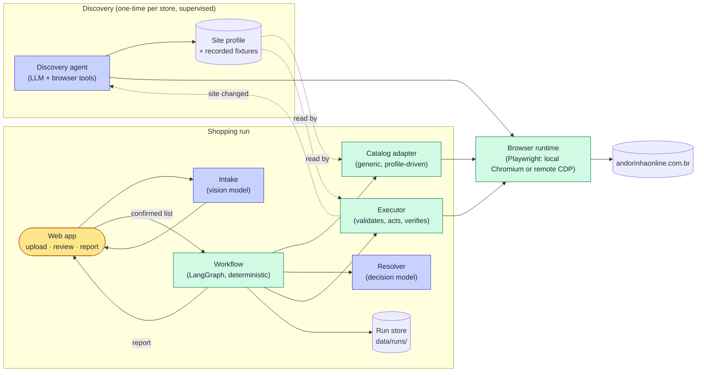
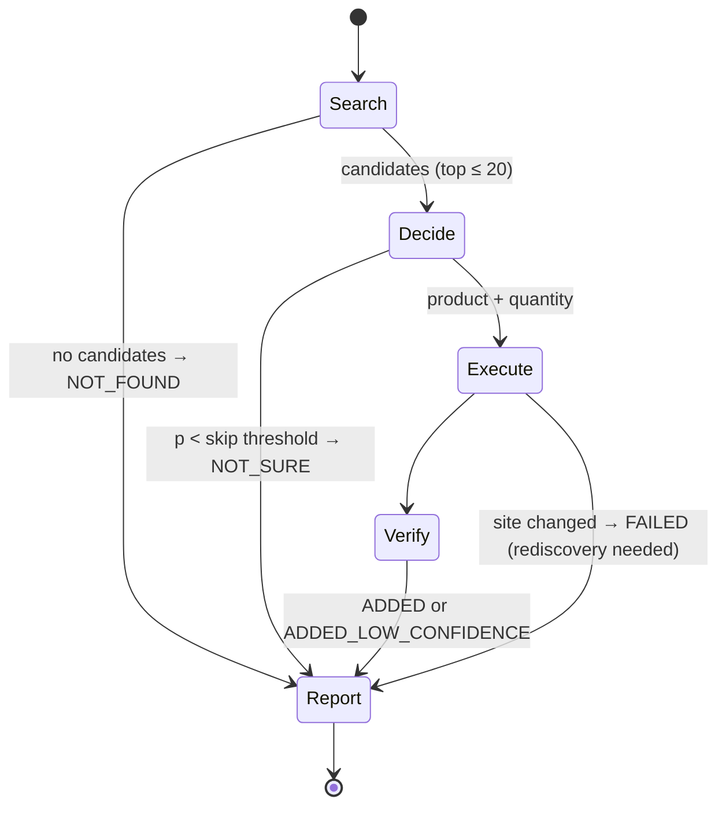
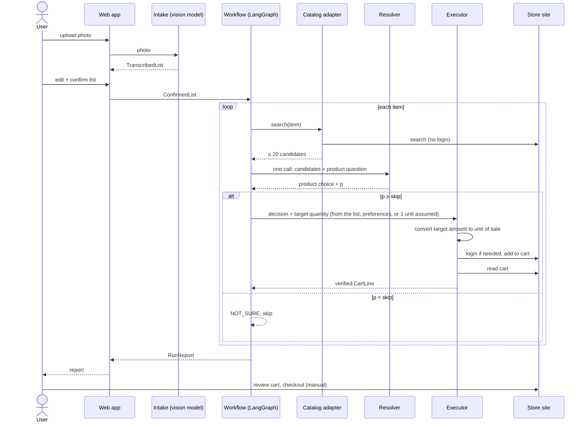

# Shopping Minion — High-Level Design (v0)

- **Status:** Approved (2026-09-29)
- **Date:** 2026-09-29
- **Updated:** 2026-09-30, to match [ADR-0012](adr/0012-the-store-is-used-through-its-site-in-a-browser.md) and [ADR-0013](adr/0013-target-quantity-is-derived-not-asked.md).
- **Scope:** v0, with the direction for what comes after. Decisions that are costly to reverse are listed in [§12](#12-proposed-adrs) as ADRs to write; this document references them but does not replace them.

## 1. Goal

A local web app that takes a photo of a handwritten grocery list, lets a human confirm what was read, then searches a real supermarket, picks products and quantities, adds them to the cart, and returns a report. Checkout stays manual.

**v0 is done when** one real photo, reduced to three items, produces a correct cart on [Andorinha](https://andorinhaonline.com.br/) and a report that says what was added and how confident the system was. The three items cover the three units of sale from [ADR-0004](adr/0004-store-catalog-adapters.md):

| Item | Unit of sale |
|---|---|
| Atum | `unit` |
| Papel higiênico | `pack` |
| Filé de peito de frango | `weight_step` |

**Not in v0:** reviewing or refining the model's choices, asking clarifying questions, substitutions, using purchase history, other intake channels (Telegram, WhatsApp, agent platforms), multiple users, hosted deployment.

## 2. Principles

Carried over from the accepted ADRs, plus what the design interview added:

1. **Deterministic where mistakes are expensive, models where language is fuzzy** ([ADR-0005](adr/0005-model-decides-executor-acts.md)). At shopping time, no model drives the browser.
2. **A human confirms the transcribed list before anything runs** ([ADR-0002](adr/0002-human-review-of-transcribed-list.md)).
3. **Store knowledge is data, not code.** A one-time discovery step learns how a store's site works and writes it down as a site profile. A generic, deterministic adapter executes that profile.
4. **Portable by default.** v0 runs with `uv` and a Playwright-managed Chromium, no Docker. Every environment-specific piece (browser, model provider, storage) sits behind an interface that can later point at a hosted service.
5. **Every model call is a role with its own configurable model.** No hard-coded provider.

## 3. System overview

Two modes share the same browser runtime and store adapter:

- **Discovery** runs once per store, supervised, and produces a site profile. It runs again only when shopping detects that the site changed.
- **Shopping run** is what the user triggers from the web app.



<sub>🟨 human step · 🟦 model · 🟩 deterministic code</sub>

## 4. Components

### 4.1 Web app

FastAPI + HTMX + [Pico.css](https://picocss.com) (no JS build step, dark mode included). Three screens:

1. **Upload:** photo from desktop or phone (on the local network).
2. **Review:** the photo next to the parsed items. Edit, split, merge, delete, add lines, then confirm ([ADR-0002](adr/0002-human-review-of-transcribed-list.md)).
3. **Run and report:** per-item progress while the run executes (HTMX polling or server-sent events), then the report (§6).

`uv run shopping-minion serve` starts it. Binding to `0.0.0.0` so a phone on the same network can reach it is an explicit flag, not the default.

### 4.2 Intake

A vision model reads the photo and returns a `TranscribedList` (structured output). It handles the cases tagged in [`list-001.yaml`](../evals/fixtures/list-001.yaml): multi-item lines, constraints ("preto não"), misspellings, inline quantities, categories that aren't products, and duplicates. Anything it can't settle, it marks `needs_clarification`. The human decides at review.

Model role: `intake`. Candidates in v0: Claude Sonnet 5.5, Claude Haiku 4.5. GLM 5.3 comes later (§4.9).

### 4.3 Workflow (LangGraph)

A **deterministic graph**, with no LLM orchestrator in v0: the order of steps is fixed and known. LangGraph provides the state machine, per-item fan-out, checkpointing (so a run can resume after a failure), and a natural place to add a clarification step with human-in-the-loop interrupts in v1.



The graph runs once per confirmed item. Items are processed one at a time in v0, because the cart is shared state on a single browser session.

### 4.4 Catalog adapter (generic, profile-driven)

This implements the `CatalogAdapter` protocol from [ADR-0004](adr/0004-store-catalog-adapters.md) **once, for every store**, by executing the store's site profile: the user steps to search (the search page or box), how to read each result into `Candidate` fields, and how the unit of sale is expressed. The adapter drives the site in the browser; it never calls the site's endpoints directly ([ADR-0012](adr/0012-the-store-is-used-through-its-site-in-a-browser.md)).

- **Search** works without login on Andorinha.
- **Pre-ranking:** the adapter returns at most 20 normalized candidates per item, ranked by text similarity plus preferences ([ADR-0003](adr/0003-preferences-as-static-yaml.md)). This is where brand and variant preferences cut the list down, and it keeps the resolver within Julia-1's 2–20 option limit (§4.5).
- The adapter never decides anything. It retrieves and normalizes.

### 4.5 Resolver

It makes **one call per item**, with one typed multiple-choice question over a state:

- **The state:** the requested item, its constraints, its preferences, and the full candidate details.
- **The question:** which of the ≤ 20 candidates matches the requested item?

The model doesn't choose the quantity. The **target quantity** is derived by rule, in this order ([ADR-0013](adr/0013-target-quantity-is-derived-not-asked.md)):

- **A.** the quantity written on the list;
- **B.** otherwise, `default_quantity` from the preferences;
- **C.** otherwise, **1 unit**, and the item carries a `QUANTITY_ASSUMED` flag and is highlighted in the report for review, whatever its confidence. Post-v0, the user's corrections to those items feed back into the preferences.

The target is expressed independently of any product (`1 unit`, `~500 g`, `~1 kg`). A unit the system doesn't know ("2 latas") is counted as that many units and flagged `QUANTITY_ASSUMED`. The executor converts the target into the chosen product's unit of sale (§4.6), so the model never does unit arithmetic.

The answer comes with a probability, which is the decision's confidence (§5).

Julia-1 takes the question in one `predict`; an LLM backend returns the choice in one structured output.

The resolver sits behind a `DecisionBackend` interface with interchangeable implementations. The evaluation harness (§8) decides which one becomes the default:

| Backend | Where it runs | Notes |
|---|---|---|
| Claude Haiku 4.5 | API | Baseline resolver, compared on equal terms with the others (not used as an LLM judge). Can also return a rationale. Confidence comes from the model, not calibrated. |
| [Julia-1](https://huggingface.co/SupersonicLabs/Julia-1) | Local CPU | Open source (Apache 2.0), 144M params, calibrated probabilities, 2–20 options, no rationale. Released 2026-09-26. |
| [Jev](https://typesafe.ai/blog/introducing-system-one-models-and-jev) | API (early access) | Placeholder until access is granted. |

**Rationale becomes optional.** [ADR-0005](adr/0005-model-decides-executor-acts.md) asks for a short rationale with each decision. Calibrated choice models don't produce one. The report shows the rationale when the backend provides it, and the top alternatives with their probabilities when it doesn't. This needs an ADR (§12).

### 4.6 Executor

This is the only component that writes to the store.

1. **Converts** the target quantity (§4.5) into the chosen product's unit of sale. For example, `~1 kg` of a product sold in ~500 g trays becomes 2 trays, and `~600 g` on a 200 g stepper becomes 3 steps. The rounding rule is explicit and unit-tested. When it's inexact (e.g., `~1 kg` of a 700 g pack), the item is flagged `QUANTITY_INEXACT` and the report shows it. A weight asked of a product sold by unit, or a count asked of a product sold by weight, becomes 1 unit or 1 step, flagged the same way.
2. **Validates** the decision: the candidate exists, the converted quantity is within bounds for its unit of sale, and it's in stock.
3. **Applies** the decision through the adapter, which uses the site's cart in the browser (clicking steppers, for example) as the site profile describes.
4. **Verifies** by reading the cart back and checking that the line matches.

When a step fails in a way that points to the site itself (a selector not found, an unexpected page, a page that no longer shows what the profile expects), the executor marks the item `FAILED`, stops the run, and records that **rediscovery is needed**. It does not retry with improvised actions.

Login happens here, only when the cart needs it, using `STORE_EMAIL` / `STORE_PASSWORD` from the dotenvx-encrypted `.env` ([ADR-0001](adr/0001-secrets-with-dotenvx.md)). The browser session state is kept in `.auth/`, which is git-ignored.

### 4.7 Discovery agent

This is an LLM agent (a LangGraph agent with browser tools) that explores a store's site and writes its site profile. It is the one place where a model drives a browser. That's acceptable under the spirit of ADR-0005 because it runs **before any shopping session, supervised, and never touches checkout**.

**What it has to discover**, in order:

1. **Search:** how a user searches on the site, and how the results shown map to `Candidate`.
2. **Product and unit of sale:** unit, pack, or weight step, and the step size.
3. **Login:** the flow, and whether there's a captcha, a code sent by email or SMS, or a CEP/store selection.
4. **Cart:** how to add and remove an item, and how to read the cart.
5. **Order history:** how to read past orders. This is for post-v0; it feeds the preferences generator from ADR-0003.

**Output:**
- `profiles/<store>/profile.yaml`: the site profile. It describes public site structure only and is **committed**, after a check for personal data.
- Recorded fixtures of the pages and responses it relied on, which become the adapter's regression tests (ADR-0004).

**Guardrails:**
- Checkout is not a tool the agent has.
- The only cart write allowed is adding one test item and removing it again.
- Credentials come from dotenvx; the agent never sees them in its prompt, because the login tool injects them.
- A human reviews the profile before it's used. A validation pass then runs the profile against the live site: one search, add, read cart, remove.
- Recordings of logged-in pages stay in `data/`, since they can contain personal data.

Model role: `discovery`. Default Claude Opus 5.5: it has the most complex, open-ended reasoning in the system, and it runs rarely.

**When it runs:** once per store, and again when the executor flags that rediscovery is needed. In v0, rediscovery is triggered by hand from the report.

### 4.8 Browser runtime

Behind a `BrowserProvider` interface:

- **v0:** Playwright with its own pinned Chromium (`uv run playwright install chromium`). The system Chrome is never used, which removes most "works on my machine" problems without Docker.
- **Later:** a remote browser over CDP (`connect_over_cdp`). This could be browserless in Docker, browserless SaaS, or the hosting platform's browser. Switching is configuration only.

The site profile describes browser steps only. Calling the site's internal endpoints with an HTTP client was left open in the first version of this document; it was tried on 2026-09-30, caused every problem of that run, and was removed ([ADR-0012](adr/0012-the-store-is-used-through-its-site-in-a-browser.md)).

### 4.9 Model configuration

Every model call belongs to a role, and each role is configured in one file:

```yaml
# config/models.yaml
intake:    { provider: anthropic, model: claude-sonnet-5-5 }
resolver:  { backend: haiku,      model: claude-haiku-4-5 }   # haiku | julia1 | jev
discovery: { provider: anthropic, model: claude-opus-5-5 }
# fallback: per role, one level; intake falls back to GLM 5.3 Flash (ADR-0011)
# TODO(glm): add GLM 5.3 as an intake candidate (provider integration + GLM_API_KEY in .env)
```

Chat models go through LangChain's provider-agnostic interface (`init_chat_model`), which LangGraph uses natively. Adding OpenAI, Gemini, GLM, or a local model is a config change plus an API key in `.env`. GLM 5.3 is left out of v0; the places to add it are marked `TODO(glm)` in config and code. Decision backends (Julia-1, Jev) implement `DecisionBackend` directly.

### 4.10 Run store

Each run is a folder under `data/runs/<run-id>/`, which is git-ignored. It holds:
- the photo;
- the raw transcription;
- the confirmed list (its diff against the transcription is intake eval data, per ADR-0002);
- every candidate list and decision;
- the cart read-back;
- the report.

JSON files in v0. The structure will settle as the code does, and nothing queries it yet.

## 5. Confidence policy

Two thresholds, both configurable, turn a decision's confidence (the product probability, [ADR-0013](adr/0013-target-quantity-is-derived-not-asked.md)) into a status:

| Confidence | Status | Cart | Report |
|---|---|---|---|
| ≥ `high` | `ADDED` | added | normal |
| ≥ `skip` and < `high` | `ADDED_LOW_CONFIDENCE` | **added** | flagged as a risk, with the top alternatives |
| < `skip`, or `needs_clarification` | `NOT_SURE` | **skipped** | shown as "not sure", with the top candidates |
| no candidates | `NOT_FOUND` | skipped | shown |
| any of the above, with the target quantity assumed as 1 unit (rule C, §4.5) | adds the `QUANTITY_ASSUMED` flag | unchanged | highlighted for review |
| execution failed | `FAILED` | skipped | shown, with "rediscovery needed" when the site changed |

This **changes ADR-0005**, which says low-confidence decisions go to human review instead of being applied. In v0 they are applied and flagged; the user reviews them in the cart before checkout anyway. A new ADR supersedes that clause (§12). Threshold values are set from eval results, not guessed.

## 6. Report

This is the last screen of a run. One row per confirmed item, with:
- requested item → chosen product (link, brand, size, price);
- quantity, in the product's own unit of sale, marked when it was assumed (`QUANTITY_ASSUMED`);
- confidence and status;
- rationale or top alternatives.

A summary line gives the counts per status and the cart total. v0 has no actions on the report beyond "open cart on the store site" and "start rediscovery".

## 7. Main flow



## 8. Evaluation

- **Intake:** confirmed list vs. transcription, and fixtures vs. transcription, per difficulty tag (`multi_item`, `misspelled`, …).
- **Resolver:** product match and quantity accuracy against labelled fixtures, compared **per backend**: Haiku 4.5 vs. Julia-1, and Jev once there's access. Latency and cost are measured too. We also check calibration: how often decisions made with 0.8 confidence are actually right.
- **Discovery:** can the generated profile carry out search → add → read cart → remove on Andorinha without manual edits? Later, the same test on a second store.
- **End to end:** the three v0 items, then the full `list-001`.

The harness lives in `evals/harness/`. Resolver fixtures need recorded candidate lists, so the resolver can be evaluated offline without hitting the store.

## 9. Data contracts (Pydantic, sketch)

```text
TranscribedItem   name, quantity?, unit?, constraints[], needs_clarification, source_line
ConfirmedItem     same fields, after human review
Candidate         id, name, brand, size, unit_of_sale, price, in_stock, url
UnitOfSale        kind: unit | pack | weight_step, step_size?, pack_size?
TargetQuantity    id, label, amount, unit (unit | g | kg | pack), product-independent
Decision          item, candidate_id, target_quantity, p_product, p_quantity? (unused, ADR-0013),
                  confidence = p_product, status, flags[], rationale?, alternatives[]
SaleQuantity      candidate_id, steps_or_units, effective_amount, exact: bool   (executor output)
CartLine          product_id, quantity, verified
RunReport         run_id, items[Decision + CartLine], counts, cart_total
SiteProfile       store, version, search, product, unit_of_sale, login, cart, history
```

## 10. Portability and deployment

- **v0:** `uv sync && uv run playwright install chromium && uv run shopping-minion serve`. Linux and macOS. No Docker.
- **Later (hosted agent on DigitalOcean, GCP, AWS, or an agent platform):**
  - swap the `BrowserProvider` for a remote CDP browser;
  - move the run store to object storage;
  - read secrets from the platform instead of dotenvx;
  - add an intake channel that isn't the web upload.

  None of this changes the core. A container image may appear at that point as packaging, not as a v0 requirement.

## 11. Security and personal data

Everything in [ADR-0001](adr/0001-secrets-with-dotenvx.md) and `CLAUDE.md` still applies. In addition:
- The discovery agent is the only model with browser access, and it has no checkout tool.
- Credentials are injected by tools and never placed in prompts.
- `.auth/` (browser session state), `data/runs/`, and logged-in recordings are git-ignored.
- Site profiles and public-page fixtures are committed, only after a check for personal data.

## 12. Proposed ADRs

| # | Title | Relation |
|---|---|---|
| 0006 | Store knowledge comes from a discovery agent that writes a site profile; a generic adapter executes it | Extends 0004. Scopes 0005's "the model never browses" to shopping time. |
| 0007 | Browser runtime: Playwright-managed Chromium locally, remote CDP later; no Docker in v0 | New |
| 0008 | Low-confidence decisions are added and flagged; below the skip threshold, items are skipped as NOT_SURE | Supersedes 0005's low-confidence clause |
| 0009 | Workflow on LangGraph as a deterministic graph; one configurable model per role, no fallback in v0 | New |
| 0010 | Resolver makes one call per item with two typed multiple-choice questions (product, product-independent target quantity) behind a `DecisionBackend`; the executor converts quantity to unit of sale; rationale optional; backend chosen by evals | Amends 0005's rationale requirement. Its quantity question was superseded by 0013. |
| 0011 | Intake falls back to a second model when the first fails (added after approval, 2026-09-30) | Supersedes 0009's no-fallback clause |
| 0012 | The store is used through its site, in a browser, the way a user would; endpoints are never called directly (added after approval, 2026-09-30) | Closes 0007's raw-HTTP opening |
| 0013 | The target quantity is derived by rule (list, then preferences, then 1 unit flagged `QUANTITY_ASSUMED`), not asked of the model; the resolver asks one question, the product (added after approval, 2026-09-30) | Supersedes 0010's quantity question |

## 13. Build plan

Discovery and the v0 shopping path are built together. The first adapter comes from discovery, not from the old prototype.

| Milestone | Delivers | Done when |
|---|---|---|
| M0 | Package skeleton, contracts (§9), `config/models.yaml`, `BrowserProvider` | Tests pass, and a headless Chromium opens Andorinha |
| M1 | Web app: upload → intake → review | The `list-001` photo becomes an editable list |
| M2 | Discovery, part 1: search + unit of sale → profile v1 | Profile-driven search returns normalized candidates for the three items |
| M3 | Resolver (single call, Haiku backend, quantity by rule) + executor quantity conversion | Offline eval on recorded candidates for the three items; conversion unit-tested |
| M4 | Discovery, part 2: login + cart → profile v2. Executor add/verify | The three items are in the cart and verified |
| M5 | LangGraph workflow, confidence policy, report, run store | Full v0 flow from the web app |
| M6 | Julia-1 backend + resolver eval comparison | Numbers for both backends, and thresholds set from data |

## 14. Resolved questions

Asked in the first draft and answered by Johann during review. The answers are already reflected above.

| # | Question | Decision |
|---|---|---|
| 1 | Haiku's role in evals: baseline resolver, LLM judge, or both? | Baseline resolver only, compared with Julia-1 and Jev. |
| 2 | Target quantity when the list says nothing? | `default_quantity` from preferences, or 1 unit when undefined. An assumed quantity is flagged for review in the report. Later, user feedback updates the preferences. Now a rule, not a model question: [ADR-0013](adr/0013-target-quantity-is-derived-not-asked.md). |
| 3 | Site profiles: committed or local-only? | Committed, after a check for personal data. |
| 4 | Julia-1 is three days old: include it? | Yes, as one more backend in the evals. |
| 5 | GLM 5.3 for intake in v0? | Not in v0. Marked with `TODO(glm)` stubs so it's easy to add later. |
