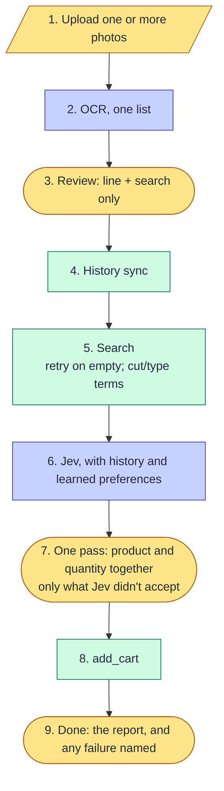

# Shopping Minion — M5: UX and preferences (design)

- **Status:** Answered by Johann on 2026-10-02 (§9) and folded in. He said to go ahead ("respondido no hld-m5, pode seguir"). The LLD is [lld-m5.md](lld-m5.md).
- **Date:** 2026-10-02
- **Sources:** [ideas-m5.md](ideas-m5.md) (Johann's notes from runs 9–11), [roadmap.md](roadmap.md) §M5, [lld-m4.md](lld-m4.md) §16 (what M4 measured and left open).
- **Shape:** like M4, this is the design (HLD level). After approval it becomes `lld-m5.md` with contracts and tasks. M5 changes the design in two places: what the app learns and keeps (our own runs as a source of preferences), and how the user goes through a run (one pass instead of two). So it gets its own design first.

## 1. Where M4 left things

These are facts from runs 9–11: Johann's real list of 2026-10-02, 88 items in 3 pages.

- **Jev isn't the bottleneck anymore.**
  - It decided 48 of 78 items alone with no wrong accept, and took 1–3 s per run.
  - Its pick was the final product for 85% of the items bought before.
- **The 11 misses** are mostly brands Johann alternates between: Bauducco or Nutrella, Limpol or Ypê, Litoral or Apolo. Both products of each pair are in his orders, so history alone can't tell them apart.
- **Johann's time is the bottleneck.** Run 10: 22 min of his time for 30 items.

  | Step | His time |
  |---|---|
  | List review | 8 min |
  | Picking | 9 min |
  | Cart review | 5 min |

  His notes say why:
  - the review cards show five fields when two matter;
  - picking and quantities are two passes over the list, about 80 decisions for 40 items;
  - the yellow badges can't be told apart at a glance.
- **Execution failures cost more than Jev's misses.**
  - Run 11 had no Jev miss, and still only 4 of 10 products reached the cart.
  - Two causes are fixed: quantities above 1 kg, and the duplicated Peso/Unidade switch.
  - Two are open: an add that never starts a stepper (água sanitária, alface), and searches that came back empty once (goiaba, uva, mamão, cebola).
  - Every such failure sends Johann back to the store's site, which is what the project exists to avoid.
- **Search terms for meat and produce are wrong.**
  - "carne de panela acém" returned only Sopão Maggi.
  - "carne moída paleta" returned nothing.
  - "salsinha" returns nothing, because the store says "salsa".
  - "acém ou paleta" was read by the OCR and ended as a constraint, not as two searches.

## 2. Goal and done-when

**Goal:** a long real list goes from photo to a cart Johann doesn't need to recheck on the site, with less of his time, and Jev deciding more of it.

**Done when** (Johann, Q1): on a real list of 40+ items through the web app, all of these hold:
1. **Execution:** every product that was decided is in the cart, with the right quantity, by the app's own check. If one fails, the done screen says which one and why.
2. **Jev:** its pick is the final product for **≥ 90%** of items with history (Johann, Q1; M4 had aimed at 95% and reached 85%). Wrong accepts are counted, not forced to 0 (LLD-M4 R1 Q1).
3. **Time:** Johann's time per item is **half** of run 10's: about 22 s per item instead of 45 s.

## 3. The flow, after M5

**What changes from today:**
- several photos instead of one;
- a review card with two fields;
- picking and the cart review become one screen, with product and quantity together;
- learned preferences go into Jev's question.

**The separate cart review becomes optional** (Q5). Quantities and removals move into the one-pass screen. At its end an optional "revisar tudo" button opens the full list, where any line can be edited again before the cart is filled.

## 4. Part A: a cart that doesn't need rechecking

1. **The add that never starts a stepper** (água sanitária 5 L, alface). The cause is unknown.
   - Finding it needs a click on "Adicionar", and code driven by Claude never writes to the cart.
   - So Johann looks once, by hand, at what the page does on that click: a dialog, a minimum quantity, an out-of-stock notice (Q2).
   - Then the add pass handles that case, or names it on the done screen.
2. **Empty searches:**
   - **Retry:** a search that returns 0 is opened once more before it counts as empty.
   - **Log:** the `search` rows (from M4) show it.
   - **Fallback:** if it is still empty, the item goes to the picker with a field for a new term, right there. This was already on the roadmap's list ("lanche infantil").
3. **The done screen names every failure:** product, expected, found, and the store's message. Today the outcome is in memory and the logs, and Johann reads the store's site to find what's missing.
4. **Fix from the review:** after the run, the done screen offers "tentar de novo" for the failed lines only. It is the same add pass, on those products.

## 5. Part B: Johann's time

From [ideas-m5.md](ideas-m5.md):

1. **Several photos, one OCR.** Upload up to **five** photos (Q4), then read them as one list. The OCR call gets all the images. Whether one `claude -p` call reads several photos well is checked in the LLD, on `list-001` split in two. Lines are numbered across pages.
2. **The review card shows "linha" (what was read) and "busca" (what will be searched).**
   - Name, constraints and brand move behind "mais".
   - A line read as two products shows as one card with two search fields, grouped.
   - Quantity shows only when the list has one.
3. **One pass: product and quantity together.**
   - **Same screen:** the picking screen shows the quantity under the chosen card, prefilled, so each item is one decision.
   - **What it shows:** only items Jev didn't accept. Accepted items are listed, collapsed, at the end, for a glance.
   - **Search term on top:** the item and its search term stay fixed at the top while the cards scroll.
4. **Badges that read at a glance.** One color per meaning:

   | Badge | Color |
   |---|---|
   | quantity assumed | amber |
   | quantity from history | blue |
   | inexact rounding | gray |
   | offer | green |

   "Quantidade da última compra" becomes "**mesma quantidade da última vez que comprou este produto**". That is what it means: the same product's quantity in the newest order that has it, among the 10 synced.
5. **The M3 report on the done screen,** as already planned.
6. **Losing the connection on the phone** (Q3).
   - **What happened:**
     - the phone's screen went off, and the page said the connection was lost;
     - a reload then asked for the token again, so Johann had to rescan the QR;
     - another time he had to restart the server and rescan.
   - **Cause, read from the code:**
     - the access cookie has no expiry, so it is a session cookie the phone's browser may drop;
     - the token changes on every server start.
   - **Fix:**
     - a cookie that lasts 30 days;
     - a token kept in `data/` across restarts;
     - the page reconnecting its event stream by itself when it comes back to the foreground.
   - **Telemetry** that would show such things is left for M7 (Johann: core first, then cloud, telemetry and CI/CD).

## 6. Part C: search terms for meat and produce

1. **OCR prompt rules**, versioned and run against `list-001` as every prompt change is:
   - **Meat:** search by cut ("acém", "paleta moída", "coxa e sobrecoxa"), not by dish ("carne de panela").
   - **Produce:** the store's name ("salsa", not "salsinha"). A short synonym table lives in code (`config/search_terms.yaml`) and is filled from what fails.
2. **"A ou B" becomes two searches for one item.** Their candidates are merged (deduplicated, up to 15) into the item's options. Jev or Johann picks one product. Today the alternative is read and dropped into `constraints`.
3. **Inference, not tested:** carne fresca and hortifrúti are bought by cut or type, rarely by brand. So these items are the natural first "open" items of Part D.

## 7. Part D: preferences that learn from Johann

The 11 brand misses are where the 85% → 95% gap is. Three sources, in order of authority:

1. **Set by Johann:** "Guaraná Antarctica, não Dolly". Edited in the web app, stored in SQLite, and replacing the hand-written `preferencias.yaml`, which is imported once.
2. **Learned from his picks** (our own runs, which M4 left out on purpose: R2 Q5 said "M5 may improve on this").
   - **Data:** every pick in `run_log` says, for an item, which product he chose over Jev's.
   - **Signal:** per normalized item term, the products he chose and how often, with a recent pick weighing more than an old one.
   - **Already counted, now meaningful:** runs 9–11 are real purchases, so their picks count. The earlier runs (system tests, per Johann) are left out.
3. **Purchase history** (M4), as today.

**How it reaches Jev (Q7):** like M4's variant A, as a fact on the option, written by code: "escolhido por você nas últimas 3 vezes". Jev reads literally, and M4 showed the fact on the option works.

**Open vs fixed items** (out of M5 for now: Johann, Q7, wants to pilot more first):
- **Proposal:** an item is "open" when Johann chose 3 or more different products for it across his history and picks, and "fixed" otherwise.
- **Effect:** for an open item, every product he has chosen counts as a hit, and Jev's pick among them is accepted. The rule inside the set is: on offer first, then the cheapest per unit.
- **Status:** the sub-decision LLD-M4 left open. Not built in M5. Revisited after more real runs.

## 8. What stays out of M5

- Recommendations ("you usually buy X, add it?") and substitutes for products out of stock.
- Julia-1 (M6) and the cloud (M7).
- Automated login.
- Open vs fixed items (§7), until more piloting.
- Telemetry, CI/CD (M7, with the cloud).

## 9. Questions

Answer inline with `>` under each one.

1. **Done-when (§2).** Three conditions:
   - the app's own check finds every decided product in the cart, or names the failures;
   - 95% hits on items with history;
   - half of run 10's time per item.

   OK, or different numbers?
   > let's strive for 90% hit, the rest is ok

2. **The add that never starts a stepper (§4.1).** Next time it happens, can you click "Adicionar" by hand on that product and tell me what the page shows? Or add it now with água sanitária or alface, if they are still not in your cart.

3. **The QR code bug** (your note, run 3). What happened?
> it seems my mobile went screen off, when back it said connection lost, I tried reloading and it got lost because didn't have the token - i had to rescan. Another time I had to force stop the server and reload it. we should have telemetry to monitor things like that, but not now - let's focus on getting the core ready, then the cloud + telemetry + cicd etc.

4. **Several photos (§5.1).** Up to how many pages, in one OCR call? Proposal: up to 4.
> 5 should be enough.

5. **One pass (§3, §5.3).**
   - Merge picking and the cart review into one screen, with product and quantity together, and drop the separate "revisar o carrinho" step.
   - Accepted items are listed collapsed at the end.
   OK, or keep a final review screen?
> keep an optional review button in the end and let go back to edit if the user wants to. 

5. **Accept threshold.** Move `accept_at` from 0.8 to **0.75** now. On runs 9–11 that is 53 accepts with 1 miss, against 48 with 0. `confidence_report` is rerun after every run, and the threshold moves again only with more data. OK?
> ok

6. **Learned preferences (§7).** Picks from runs 9 onward count, and the earlier runs don't. Each pick is shown to Jev as "escolhido por você N vezes", like history. OK?
> ok. now we can use runs >=9 as test data.

7. **Open items (§7).**
   - Is "3 or more different products chosen" the right test?
   - Should the rule inside an open set be offer first, then cheapest per unit?
	 Or do you want to mark open items yourself, for example meat and produce?
> still not sure on what to do on this one - let's fix the rest and go back to pilot this a bit more

7. **Order of work.** Proposal:
   8. Part A (a cart that doesn't need rechecking);
   9. Part B (your time);
   10. Part C (search terms);
   11. Part D (preferences).

   A and B make every later measurement cleaner. OK?
>ok 