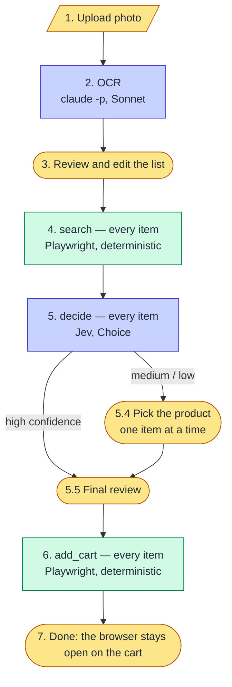

# Shopping Minion — High-Level Design (v0, after the reset)

- **Status:** Approved by Johann on 2026-10-01
- **Date:** 2026-10-01
- **Sources:** [project-reset.md](project-reset.md), [hld-interview-001.md](hld-interview-001.md), [lessons-learned.md](lessons-learned.md)

## 1. Goal and scope

Photo of a handwritten list → a cart at andorinhaonline.com.br, ready for a human to review and check out. The point is to save time on long lists (50+ items).

Out of scope for v0: checkout of any kind, other stores, cloud hosting, a mobile app, Docker.

Principle: **complexity has to be earned before it's introduced.** One store, code written for that store, no generic layers.

## 2. Flow



Each step runs over the whole list before the next one starts. The browser is used in steps 4 and 6 only. Models are used in steps 2 and 5 only, and neither one touches the browser or the cart.

## 3. Components

One Python package, `src/shopping_minion/`, with one module per step. No framework between the modules: the app calls the steps in order and keeps their results in SQLite.

### 3.1 OCR (`intake`)

- Runs `claude -p` with the Sonnet model (Haiku until 2026-10-01; changed by Johann after the list-001 comparison, LLD §8.2), the prompt in [`src/shopping_minion/prompts/intake.md`](../src/shopping_minion/prompts/intake.md), and a JSON Schema for the output (`--json-schema`). It reads the photo with the Read tool and no other tool is enabled. It uses Johann's Claude login, so it needs no API key.
- The JSON Schema itself is defined in the LLD. Structured outputs require one ([docs](https://platform.claude.com/docs/en/build-with-claude/structured-outputs)).

- Each item has `source_line`, `name`, `search_term`, `constraints`, `brand`, `quantity`, `unit` and `needs_review`. The prompt has the rules for slashes: separate products vs. a qualifier of the same product.
- The prompt is versioned with the code. Any change to it is run against `evals/fixtures/list-001.yaml`, and the result goes in the commit message.

### 3.2 Browser (`browser`)

- Playwright with its pinned Chromium, **headless since 2026-10-02** (Johann; `login` still opens a window, since a person types there; it was `headless=false` until then), and a regular desktop Chrome user agent: the browser's own one with `HeadlessChrome` replaced by `Chrome`. alfa0 observed that a `HeadlessChrome` user agent gets 0 results.
- One persistent context. The session is saved in `.auth/andorinha.json`.
- **Login:** the first time, Johann logs in by hand in the Playwright window, and the session is saved. If it expires, the app pauses and asks him to log in again. Email and password are not used yet (§7).
- The store is used only through its pages, as a user would: no HTTP client and no hand-built requests.

### 3.3 search

- For each item: open `/busca/<search_term>`, wait for the results, and read the first ~15 products. The fields are name, brand, size, price, discount, unit of sale (un/kg), stepper increment and availability.
- Data comes from the JSON response the search page itself receives (`hits[]` with `pricing`, seen in alfa0). It is read as the page receives it; no request is made by hand. The DOM is read only for what that response doesn't have (§8, Q1). M0 confirms the fields.
- Items are searched one after another in the same window. The web app shows a progress bar.

### 3.4 decide (Jev)

- One Choice per item. The options are the item's candidates plus `nenhum` ("none of these fits"). Each option's description is the candidate's name, brand, size, price and unit of sale.
- The state has only what the question needs: the item (`name`, `constraints`, `brand`, `source_line`) and, if the preferences file has an entry for it, that entry.
- Five items per call (interview, Q2), with each question carrying its own item, preferences and candidates in its `instructions` and `criteria`. The shared `state` stays minimal (§8, Q2). If that measures worse on the 7 cases, it falls back to one item per call, run in parallel.
- Policy on the answer's `confidence`. The thresholds live in `config/decide.yaml`, not in code. These are placeholders, to be calibrated on the 7 resolver cases:
  - **≥ 0.8:** accept the chosen product. If it's `nenhum`, the item goes to the user.
  - **0.5 – 0.8:** goes to the user, with Jev's pick first.
  - **< 0.5:** goes to the user, flagged "nothing fit".
- Arithmetic stays in code: Jev doesn't do math well (jev-1.13 notes).

### 3.5 Quantity

Rule, not model (from alfa0 ADR-0013):

1. The quantity written on the list.
2. If none, the preferences file.
3. If none, 1 unit, flagged for review.

Code converts the target into the product's unit of sale: units, packs, or stepper clicks for weight-sold products. A conversion that isn't exact is flagged.

### 3.6 Preferences (`data/preferencias.yaml`)

- Hand-written, with field names in pt-BR. Kept out of git. The repo has `preferencias.exemplo.yaml`.
- Example:

  ```yaml
  feijão:
    apelidos: [feijão normal]
    variante: carioca
    excluir: [preto]
    quantidade: { valor: 1, unidade: kg }
  presunto:
    fatiado: true
    quantidade: { valor: 300, unidade: g }
  ```

- Used in two places: as context for Jev, and as step 2 of the quantity rule.

### 3.7 add_cart

- For each decided item, find the product on the site and add it. Expected route, to be confirmed in M0 (§8, Q3): the search response gives each product an id, and the search page's card carries the same id. If so, add_cart opens the search again and picks the card by id, not by name. Then click `+` until the cart shows the target quantity.
- **One item at a time, never in parallel.**
- **Race conditions:** after each click, wait until the quantity shown changes before clicking again. Each click has a timeout, and the quantity is read back at the end.
- If the cart already has the product, or the quantity can't be confirmed, the item is marked failed and the run moves on.
- Progress bar in the web app.
- At the end, the browser opens the cart page and **stays open**. Checkout is manual.

### 3.8 Storage (`data/shopping-minion.sqlite`)

Runs, the original list, the confirmed list, the candidates per item, Jev's answers, the user's picks and corrections, and the cart result. v0 only writes it and shows it. It is the raw material for preferences built from history (§7).

### 3.9 Web app

- FastAPI, with Vue loaded from a CDN (no Node build) and a dark blue theme.
- Screens:
  1. upload;
  2. review the list;
  3. progress (search);
  4. pick a product, one item at a time;
  5. final review;
  6. progress (cart);
  7. done.
- Progress is sent to the page as server-sent events.
- Local only, at `127.0.0.1`, with a `--lan` flag to open it from a phone on the same network.

## 4. Stack

Python 3.12 with uv, `playwright`, `fastapi` with `uvicorn`, `typesafe-sdk`, `pydantic`, `pyyaml`, and the standard library's `sqlite3`. ruff and pytest. No LangChain or LangGraph.

## 5. Secrets

dotenvx, as before. New: `TYPESAFE_API_KEY`. The OCR needs no key, since it uses the Claude login. `STORE_EMAIL` and `STORE_PASSWORD` stay in `.env`, unused until §7.

## 6. Milestones

| # | What | Done when |
|---|---|---|
| M0 | Look at the site | Johann and Claude open the search and the cart in a headed Playwright window, add one product by hand from code, and write down what was seen: the fields of the search response, whether a product id links that response to its card on the page, the stepper, and how the cart shows quantities. Confirms Q1 and Q3. |
| M1 | CLI, 3 items, real cart | `shopping-minion run lista.jpg` (or a list in YAML) runs search → decide → add_cart for 3 items and the real cart has them in the right quantities. The OCR eval runs on `list-001`, and the Jev eval on the 7 cases. |
| M2 | Web app | The whole flow in the browser, with progress bars and the screen for picking a product. |
| M3 | Full list | `list-001` from photo to cart. Time and number of corrections measured. |

The LLD comes after this HLD is approved. It is planned by Opus and run by Sonnet.

## 7. Decided for later

- **Automated login** with `STORE_EMAIL` / `STORE_PASSWORD` (interview, Q5).
- **Preferences from purchase history**, using the SQLite history and the store's past orders (journal 0008). Now M4, see §9.
- **Julia-1** as an alternative backend for decide.

## 8. Questions resolved in review

| # | Question | Answer (Johann, 2026-10-01) |
|---|---|---|
| 1 | Where search reads the results from | The JSON response the page itself receives. DOM only for what it lacks. Confirmed in M0. |
| 2 | Five items per Jev call | Five questions per call, each carrying its own item in `instructions`/`criteria`, with a minimal state. Fall back to one item per call if it measures worse. |
| 3 | How add_cart reaches the product | Small discovery in M0: Johann suspects each product has an id that also marks its card in the search page. If so, add_cart searches again and selects the card by id. |
| 4 | OCR prompt | Approved: [`src/shopping_minion/prompts/intake.md`](../src/shopping_minion/prompts/intake.md). |
| — | OCR JSON Schema | Defined in the LLD. |
| — | Policy thresholds | In a YAML config file (`config/decide.yaml`). |
| — | add_cart | Never runs in parallel. |
| — | Theme | Dark blue. |

## 9. M4: purchase history (2026-10-02)

M4 adds a data source: the store's order history.
- **Approved design:** [lld-m4.md](lld-m4.md) Part 1, approved by Johann on 2026-10-02.
- **What changes in the flow:**
  - **Sync step:** a read-only history sync runs before the search. It reads the JSON the order pages receive and stores the orders in SQLite.
  - **Matching:** code matches each item's candidates to the orders by product id.
  - **The question to Jev:** history goes into it, in a variant chosen by an eval.
  - **Quantity rule:** the last quantity bought becomes a step between the preference and the 1-unit default.
- **Unchanged:** no model touches the browser or the cart, and nothing on the order pages is clicked.
