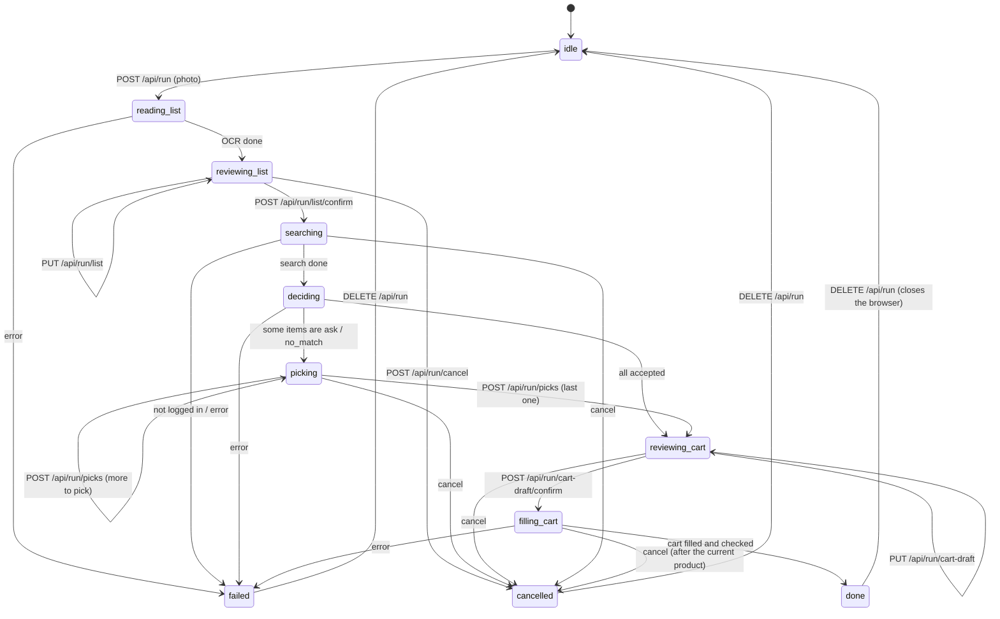

# Shopping Minion — Low-Level Design (M2: the web app)

- **Status:** Draft, for Johann's review (round 2 folded in)
- **Date:** 2026-10-01
- **Implements:** [hld.md](hld.md) §3.9 (approved). It builds on [lld.md](lld.md) (M0, M1, accepted).

**Scope:** the whole flow in the browser, replacing the terminal:

1. upload;
2. review the list;
3. search with progress;
4. pick a product, one item at a time;
5. review the cart draft;
6. fill the cart with progress;
7. the cart check.

The CLI stays. The duplicate-product fix from the first end-to-end run is in scope too (§6), because the cart-draft review is where it shows.

Out of scope: login automation, preferences from history, Julia-1, more than one run at a time, hosting anywhere but this machine, a native mobile app.

## 1. Shape

```
browser (Vue app; desktop or phone on the same Wi-Fi)
   │  JSON + server-sent events
FastAPI (web/app.py)
   │
web/statemachine.py ── the run's states (§4), the event log, and the worker thread
   │                    that owns the Playwright browser (one window, stays open at the end)
workflow.py ────────── the steps of shopping a list, no I/O (§3); the CLI uses it too
```

- **Playwright's sync API has to be used from the thread that created it, and FastAPI runs on an event loop.** So one worker thread per run owns the browser. The web layer hands it jobs through a queue. This is the one new piece of machinery, and it exists because of that constraint.
- **One browser window for the whole run** (Johann, round 1). It opens at search and stays open through picking and filling, until the run ends. That keeps the browser behind one owner, which also fits a future browser in Docker or on a hosted service.
- One active run at a time. Starting a second returns `409`.
- Run state lives in memory while the run is active, and every step is also written to SQLite as today. If the server restarts mid-run, that run is lost; the history stays.

## 2. Files

```
src/shopping_minion/
  workflow.py          search_list, decide_list, draft_cart, fill_cart; no I/O (T6)
  merge.py             duplicate lines → one draft line (T6, §6)
  run.py               CLI, now calling workflow.py (T6)
  items.py             + Candidate.image (T6)
  search.py            fills Candidate.image from the hit (T6)
  web/
    app.py             FastAPI app, routes, SSE, access token (T7)
    statemachine.py    RunStateMachine: states, transitions, worker thread, event log (T7)
    static/
      index.html       Vue 3 from a CDN, no build step (T8)
      app.js
      style.css        dark blue theme, responsive
cli.py                 + `serve [--local] [--port 8000]` (T7)
tests/test_workflow.py, test_merge.py, test_web.py, test_ui.py
```

New dependencies:
- `fastapi`, `uvicorn` and `python-multipart` (for the upload);
- `qrcode`, for the access QR in the terminal (text) and on the desktop page (SVG). Its SVG output needs no imaging library.

Vue 3 loads from `cdn.jsdelivr.net`, pinned to an exact version.

## 3. Workflow (`workflow.py`, T6)

`run.py`'s `_run_stages` mixes the steps with `input()`/`print()`. They move into functions with no I/O, which the CLI and the web both call:

```python
def search_list(page, items, progress) -> list[list[Candidate]]
def decide_list(items, candidates, prefs, config, client) -> list[Decision]
def draft_cart(decisions, prefs) -> CartDraft          # lines, skipped, merged duplicates (§6)
def fill_cart(page, draft, progress) -> CartOutcome   # cart before, results, cart after, check
```

- `CartDraft` holds one `DraftLine` per product: the `Candidate`, the target quantity, the `CartTarget` (clicks) and flags. It also lists the list items the line comes from, which can be several after a merge, and the skipped decisions. `line_id` is the product id.
- `CartOutcome` holds the cart read before, the `CartResult`s, the cart read after, and the `reconcile` checks and extras.
- `run.py` keeps its terminal prompts and printing, built on these. Its tests keep passing, adjusted only where names change.
- `Candidate` gets `image: str | None`, from the hit's `image` field. Only the web page uses it (§7.5).

## 4. State machine (`web/statemachine.py`, T7)



States are named by what happens in them. The machine works in `reading_list`, `searching`, `deciding` and `filling_cart`. You work in `reviewing_list`, `picking` and `reviewing_cart`.

| State | What happens |
|---|---|
| `reading_list` | The photo is saved to `data/uploads/<run_id>.<ext>` and `transcribe(photo)` runs (Sonnet, ~25 s) in a plain thread. No browser. |
| `reviewing_list` | Waits for you. `PUT /api/run/list` saves edits, so a page reload keeps them. `/confirm` moves on. |
| `searching` | The worker opens the browser (headed) and runs `ensure_logged_in`. If you're logged out, the run goes to `failed` with "faça login: `shopping-minion login`". Then `search_list`, with one event per item. |
| `deciding` | `decide_list` (Jev). One event when it starts and one when it ends. |
| `picking` | Waits for you on the items with status `ask`/`no_match`, one at a time. If there are none, the run goes straight to `reviewing_cart`. |
| `reviewing_cart` | Runs `draft_cart`, then waits for you. Each `PUT /api/run/cart-draft` returns the draft recomputed (clicks, flags, estimated total). |
| `filling_cart` | `fill_cart` on the worker, with one event per product. |
| `done` | The check is available. **The browser window stays open** on the cart until `DELETE /api/run` (the "fechar navegador" / "nova lista" buttons) or the server stops. |
| `failed` / `cancelled` | Kept apart: a cancel isn't a failure. Both keep their message. A cancel during `filling_cart` stops after the current product, and nothing more is added. |

**Events:** a list of `{seq, state, kind, data}` held by the state machine. SSE streams from a given `seq`, so a page reload resumes without missing events.

## 5. HTTP API (T7 builds it, T8 uses it)

All JSON. Item, Candidate and Quantity use the `items.py` field names.

Each waiting state has one resource that holds what you review there, and `/confirm` moves the run past it. A call made in the wrong state returns `409 {state}`, so the page can always resync.

| Method + path | State it acts on | Body → response |
|---|---|---|
| `GET /api/run` | any | → `{state, run_id, message, list?, picks_left?, cart_draft?, outcome?}`, or `{state: "idle"}` |
| `GET /api/run/events?after=<seq>` | any | → `text/event-stream`; each event is `data: {seq, state, kind, data}` |
| `POST /api/run` | `idle` → `reading_list` | multipart `photo` → `202 {run_id}` |
| `PUT /api/run/list` | `reviewing_list` | `{items: [Item]}` → `200` |
| `POST /api/run/list/confirm` | `reviewing_list` → `searching` | → `202` |
| `GET /api/run/picks/next` | `picking` | → `{index, left, item, candidates: [Candidate & {description}], jev: {choice, confidence, nothing_fit}}` |
| `POST /api/run/picks` | `picking` (→ `reviewing_cart` after the last) | `{index, product_id \| null}` (`null` skips) → `200` |
| `PUT /api/run/cart-draft` | `reviewing_cart` | `{lines: [{line_id, quantity: Quantity \| null, remove: bool}]}` → `200 {cart_draft}` |
| `POST /api/run/cart-draft/confirm` | `reviewing_cart` → `filling_cart` | → `202` |
| `POST /api/run/cancel` | any working or waiting state → `cancelled` | → `200` |
| `DELETE /api/run` | `done`/`failed`/`cancelled` → `idle` | → `200`; closes the browser |
| `GET /api/runs` | any | → the last 5 runs from SQLite: `[{run_id, created_at, items, status}]` |
| `GET /api/access` | any (desktop only, §5.1) | → `{url, qr_svg}` |

**Shapes:**
- `cart_draft`: `{lines: [{line_id, product: Candidate, items: [item names], quantity: Quantity, clicks, flags, estimated_price}], skipped: [item names], estimated_total}`. The estimate is arithmetic in code (price × target) and labeled as such.
- `outcome`: `{checks: [{item_names, product_name, expected, found, was_before, ok, verdict}], extras: [{name, quantity, was_before}], ok_count, total}`.

**Event kinds:**
- `state` (`{state}`)
- `search` (`{i, n, term, found}`)
- `decide` (`{phase: "start" | "end", accepted, to_pick}`)
- `fill` (`{i, n, name, status, message}`)
- `error` (`{message}`)

### 5.1 Access: LAN by default, with a token

`serve` listens on the LAN by default (Johann, round 1), so you can photograph the list from your phone.

- At start the server creates a random token and prints the LAN URL `http://<lan-ip>:<port>/?t=<token>` with a **QR code in the terminal**.
- **The desktop page shows the same QR** on the upload screen, so you can scan it off the screen (Johann, round 2).
- A request from another machine without the token gets `401`. Opening the URL once sets a cookie, so the phone keeps access until the server restarts.
- Requests from `127.0.0.1` need no token: that's the desktop, on the machine that runs everything. `GET /api/access` answers only those.
- `--local` listens on `127.0.0.1` only, with no token and no QR.
- Checkout stays manual either way. The token is there so someone else on the Wi-Fi can't fill your cart.

## 6. Duplicate lines (`merge.py`, T6)

Seen on 2026-10-01: requeijão was on the list twice. Both lines chose the same product, and the second line found it already in the cart and left it alone. The cart got 1 where the list meant 2, and the check said ok for both.

- In `draft_cart`, lines whose chosen product is the same `product_id` merge into one `DraftLine`.
- **Quantity:** the sum of the targets, when both are in the same unit kind (count or weight). If one is count and the other weight, the larger click count wins and the line gets `QUANTITY_INEXACT`. Flags are the union.
- The line keeps every source item. The cart-draft review shows "requeijão ×2 (2 linhas da lista)", and the check expects the summed quantity.
- Tests: the requeijão case, kg + kg, un + kg, three duplicates, and no duplicates (draft unchanged).

## 7. Screens (`static/`, T8)

pt-BR, dark blue theme, **responsive**: one layout that works from phone width up.

1. **Enviar lista:**
   - a file input (`accept="image/*"`, `capture="environment"`, so a phone opens the camera);
   - the last 5 runs (date, items, status);
   - **on the desktop, the access QR and URL** with "abra no celular para fotografar a lista".
2. **Lendo a lista:** a spinner with elapsed seconds.
3. **Revisar lista:** the photo beside an editable table (photo on top on a phone).
   - columns: linha, nome, busca, restrições, marca, quantidade + unidade;
   - remove row and add row;
   - `needs_review` rows highlighted;
   - edits are saved as you go; the button "buscar no site" confirms.
4. **Buscando:** a progress bar `i/n` with the current term and each item's result count, from the events. Then "Jev está decidindo…".
5. **Escolher produto**, one item at a time ("3 de 28"):
   - the item and its source line, with constraints as chips;
   - Jev's note ("não tem certeza (0,56)" or "nada parece servir");
   - candidates as cards with **the product photo**, name, brand, price (struck-through list price when on sale), "por kg"/"por unidade" and "indisponível". Jev's pick comes first and is pre-selected.
   - **Enter takes the selected card**, the arrow keys move between cards, and `0` or "pular" skips. On a phone you tap the card.
6. **Revisar carrinho:**
   - the cart draft as a table: item(s) → product photo and name, price, quantity (editable), clicks, flags as badges (`quantidade assumida`, `aproximada`, `2 linhas da lista`), and remove;
   - skipped items listed below;
   - the estimated total, labeled "estimado";
   - the button "adicionar ao carrinho".
7. **Adicionando:** a progress bar with each product's status as it arrives (added, untouched, failed).
8. **Pronto:** the check, the same content as the CLI:
   - ok rows collapsed;
   - problems at the top in red: FALTANDO, QUANTIDADE DIFERENTE;
   - "não são desta lista" in amber.

   Then the line "o carrinho está aberto na janela do navegador; revise e finalize no site", and the "fechar navegador" and "nova lista" buttons.

The product photos come from the store's image CDN, loaded by **your** browser while it shows our page (Johann, round 1). Our code makes no request for them.

## 8. Tests

- `test_workflow.py`, `test_merge.py`: pure, with fakes, as today.
- `test_web.py`:
  - FastAPI `TestClient` with the workflow functions and `transcribe` injected as fakes;
  - the whole flow through the API, in the state order of §4;
  - every wrong-state call returns `409` with the state;
  - error paths: a second run, a pick for the wrong index, not logged in, cancel mid-fill;
  - the token: LAN without it gets `401`, with it a cookie is set, loopback is exempt, and `--local` binds `127.0.0.1`.
- `test_ui.py` (`live` marker, because it opens a browser): Playwright drives **our own** app at `127.0.0.1` with the fake backend through the whole flow. It never touches the store. It checks:
  - Enter accepts Jev's pick;
  - a cart-draft edit changes the clicks;
  - the done screen shows a FALTANDO row and an extras row;
  - at phone width (390×844) nothing overflows horizontally.
- The existing guards (no checkout, no hand-made requests) cover `web/` too.

## 9. Tasks

| Task | What | Depends on | Who |
|---|---|---|---|
| **T6** | `workflow.py` and `merge.py` (§3, §6), `Candidate.image`, with `run.py` moved onto them. CLI behaviour unchanged except for the duplicate merge. | — | Sonnet |
| **T7** | `web/app.py`, `web/statemachine.py`, `serve` with the access token and QR (§4, §5), and `test_web.py`. | T6 | Sonnet |
| **T8** | `static/` (§7) against the API in §5, and `test_ui.py` with the fake backend. | T6 (API contract only) | Sonnet |
| **T9** | M2 acceptance: Johann runs a real list through the web app on his account, uploading from the phone. | T7, T8 | Johann + Claude |

- **Waves:** T6, then T7 and T8 in parallel, then T9. Johann reviews each wave before merge.
- **Paid calls:** T9 only (Jev, a fraction of a cent per list). OCR runs on the subscription.

## 10. Questions resolved in review

| #    | Question                                                   | Answer (Johann, 2026-10-01)                                                                                     |
| ---- | ---------------------------------------------------------- | --------------------------------------------------------------------------------------------------------------- |
| R1.1 | Product images on the pick screen                          | Yes. `Candidate.image`.                                                                                         |
| R1.2 | One browser for the whole run                              | Yes. It also fits a future browser in Docker or on a hosted service (e.g. browser-use.com).                     |
| R1.3 | Merge duplicate lines                                      | Yes.                                                                                                            |
| R1.4 | Phone                                                      | `--lan` is the default and the layout is responsive. A native app is out for now.                               |
| R1.5 | Estimated total                                            | Yes.                                                                                                            |
| R1.6 | Module name for the steps                                  | Not `stages.py`, which doesn't say what it's for. Now `workflow.py` (steps) and `web/statemachine.py` (states). |
| R1.7 | Endpoint names (`PUT /api/run/plan` was unclear)           | Diagram first, then names that match the states (round 2).                                                      |
| R2.1 | The state diagram                                          | Approved as drawn. `done → idle` closes the browser.                                                            |
| R2.2 | State names; "cart draft"                                  | Approved.                                                                                                       |
| R2.3 | Endpoints: one resource per waiting state, plus `/confirm` | Approved.                                                                                                       |
| R2.4 | `--lan` default with a token                               | Approved, with the QR shown in the terminal **and** on the desktop page.                                        |
| R2.5 | `workflow.py` + `web/statemachine.py`                      | Approved.                                                                                                       |
