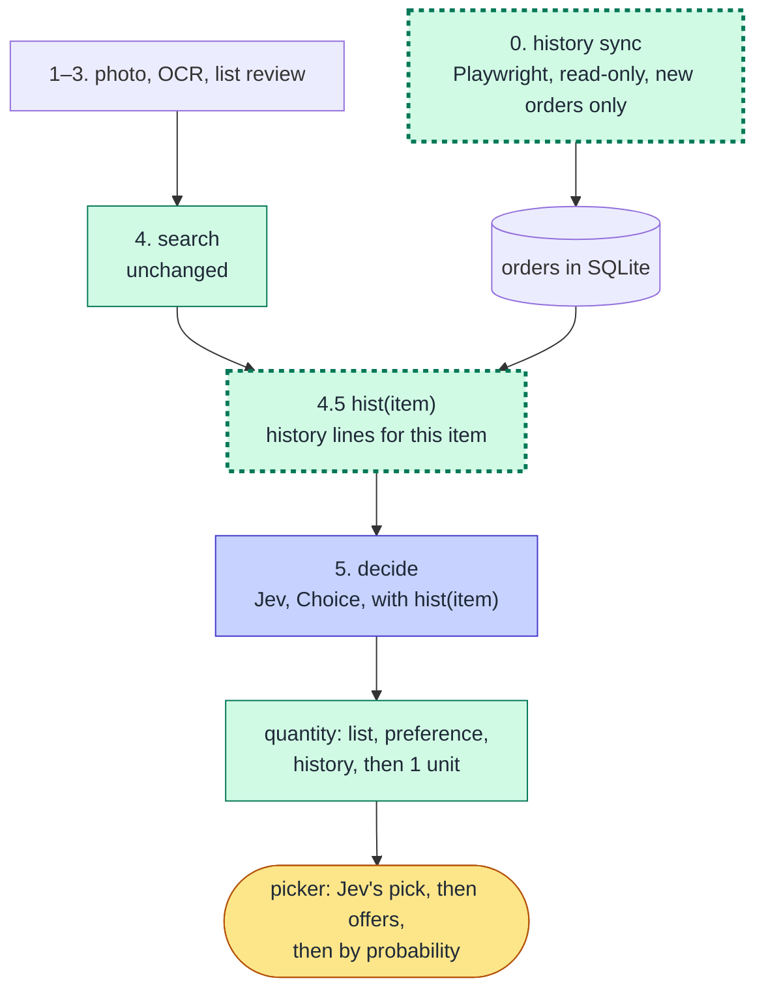

# Shopping Minion — M4: preferences from purchase history

- **Status:** Approved by Johann on 2026-10-02: Part 1 (design) and Part 2 (LLD, §8–§15), with the first sync at 10 orders. **M4 accepted on 2026-10-02 (§16).**
- **Date:** 2026-10-02
- **Sources:** [ideas-m4.md](ideas-m4.md) (Johann), [roadmap.md](roadmap.md) §M4, [journal 0008](journal/2026-09-30-0008-purchase-history-is-the-fastest-preferences.md), the M3 report ([lld-m3.md](lld-m3.md) §5).
- **Why the design is in this file:** M4 adds a data source, the store's order history, so the HLD has to change (CLAUDE.md). Johann asked for that design here, in the same doc as the LLD. Once it's approved, [hld.md](hld.md) gets a short section that points here.

# Part 1 — Design

## 1. Goal

Jev picks right more often, so Johann picks less. The M3 report is the starting line. In run 8, a 32-item list:
- Jev accepted 5 products on its own and sent 25 to Johann;
- in 13 of those 25, Jev's pick was the one Johann confirmed. **Jev was right, but not sure.**
- in 11, Johann chose another product.

The store already knows what Johann buys: his past orders. M4 reads them and uses them for two things:
- to help Jev choose (Johann's mechanism, [ideas-m4.md](ideas-m4.md));
- to suggest quantities.

**Done when** (Johann, R1 Q1): on a new real list run through the web app, Jev's pick is the product Johann ends up with for **at least 95% of the items**. Put the other way, fewer than 5% are misses.
- **A hit** means the product in the final cart is Jev's top choice. That covers two cases: an item Jev accepted that stays untouched in the cart review, and an item sent to Johann where he confirmed Jev's pick.
- **A miss** means Johann chose another product, removed Jev's pick in the cart review, or skipped an item Jev had accepted.
- **Wrong accepts count as misses.** They are not a separate zero target. Johann's reasoning: a hard zero would push the thresholds up and overfit.
- **Run 8 as the baseline:** 18 hits of 29 decided items (5 accepted, 13 confirmed), so 62%.

- **The 95% applies to items with history** (R2 Q2). History can't help an item never bought, so those are reported apart, and the overall rate too.
- **The picker count has no target** (R2 Q1). It is reported. With a high hit rate, a picked item costs one Enter.

## 2. What exists today

These are facts read from the code and the history, not plans.

- **Decide:** one Jev Choice per item. The options are the search candidates plus `nenhum`, described by name, brand, price and unit of sale. The context is the item and, if there is one, its entry in `data/preferencias.yaml` (`decide.py`).
- **Quantity:** the list's quantity, then the preference, then 1 unit flagged `QUANTITY_ASSUMED` (`quantity.py`).
- **Our own history:** SQLite has, per run:
  - the candidates Jev saw;
  - Jev's answer;
  - Johann's pick, with Jev's original choice next to it in `run_log`;
  - the cart result.

  It does **not** have what was actually bought. Checkout is manual and happens outside the app.
- **The store's order pages:** observed in T12 on 2026-10-02 ([site-notes](site-notes/andorinha.md#order-history-m4-t12-seen-on-2026-10-02)). In short:
  - the list page and each order page receive their own GraphQL JSON (`CustomerOrdersListPaginated`, `OrderDetailsQuery`);
  - the order's JSON already has every product, so "Ver mais produtos" doesn't need a click;
  - **each line carries `productId`, the same id the search uses;**
  - weighed products show the weighed amount (3.68 kg for 4 kg ordered).
- **How much history can help, measured on run 8:** the final product of **14 of its 29 decided items** appears in the last orders. That is the same with the last 5 orders and with the last 10. So the 95% target (§1) applies to about half of a list like run 8's.

## 3. Flow



Two steps are new: **history sync** and **hist(item)**. The decide question, the quantity rule and the picker's order change. Everything else stays.

## 4. Components

### 4.1 History sync (new)

- **Read-only, through the site, as a user would.** It opens `/minha-conta/pedidos` and reads the `CustomerOrdersListPaginated` response the page receives: order ids, dates and status. Then, for each order not stored yet, it opens `/minha-conta/pedidos/<id>` and reads the `OrderDetailsQuery` response: the lines with `productId`, name, quantity, unit and price. **It clicks nothing:** "Ver mais produtos" isn't needed, because the response already has every line (T12).
- **"Adicionar todos os itens ao carrinho"** is on every order page, and it writes to the cart. A guard test forbids that text in `src/`, the same way "Finalizar pedido" is forbidden.
- **Incremental and automatic:** at the start of each run, before the search, it reads only orders it hasn't stored yet. The list is newest first, so it stops at the first order id already in the database. The first sync reads the last **N orders**, with N in `config/history.yaml`: **10** (Johann, 2026-10-02, at Part 2's approval; ideas-m4.md had started at 5). All 10 fit on the list's first page. There is also a command: `shopping-minion history sync`, and `just history-sync` (R1 Q9).
- **Only finished orders** (`status: FINISHED`, the only status seen) are stored. Others are skipped until a later sync sees them finished.
- **The browser:** in the web app, the same worker thread that owns the browser for search and cart. One browser, one owner.

### 4.2 Storage (new tables)

```
orders       order_id, placed_at, total, synced_at
order_lines  order_id, line, product_id, name, quantity, unit (un | kg), total_price
```

These tables hold personal data. They stay in `data/shopping-minion.sqlite`, never committed. Test fixtures are made up. The delivery address, payment and status history in the same response are not stored.

### 4.3 hist(item): the history lines for an item

Johann's idea: `hist(item) = AI(filter hist to the lines related to [item] or [busca])`. Agreed in R1 Q2: start with code, and add a model only where code measurably misses. This is the algorithm.

**Input:** the item, its candidates from the search (up to 15), and the order lines from the last N orders (§4.1).

**Normalization**, the same as `preferences.py` plus punctuation:
- `norm(text)`: accents removed (NFKD), case folded, anything that isn't a letter or a digit turned into a space, spaces collapsed. So `laranja pêra rio kg` and `Laranja Pêra Rio Kg` both become `laranja pera rio kg`.
- `words(text)`: the words of `norm(text)`, without `de`, `da`, `do`, `das`, `dos`, `com`, `e`. Numbers and units stay: `2l` and `600ml` are different products.

**Step 1: history per candidate.** For each candidate `c`, the lines that are the same product:
- **by id:** `line.product_id == c.product_id`. T12 confirmed order lines carry the search's product id, so this match is exact, and no name match is needed for step 1.

From those lines, code computes:
- in how many orders `c` appears;
- the date of the last one;
- the quantity and unit of the last one.

That's what the question shows (§4.4). A candidate with no lines gets nothing.

**Step 2: history about the item, outside the results.** These are lines no candidate matched, but where every word of `words(item.search_term)` is in `words(line.name)`.
- *Example:* "leite" matches the line `Leite Ninho Integral 1L`, which may not be in the top 15.
- This step can also catch noise: "laranja" matches a `Suco Xando Laranja` line too.
- These lines feed variant B of the question (§4.4) and the Q6 case (§4.6). They never annotate a candidate.

**Step 3: near misses, for the eval only.** A line from step 2 that looks a lot like a candidate counts as a near miss. The test is that the two share at least 60% of their words (Jaccard over `words`).
- Near misses are listed in the eval report as possible renames. They don't change any decision.
- If the eval shows many of them, that is the measured gap that would justify a fuzzy match or a model filter.

**One function.** Steps 1–2 sit behind `lines_for_item(item, candidates, lines, k)`, so BM25, or BM25 and vectors fused with RRF, can replace the exact match later without touching `decide.py` (design note, below).

**Cost:** pure functions over at most 15 candidates × a few hundred lines per item, so nothing to worry about. No model call, and deterministic, so the tests can pin every case.

**Why not a model first:**
- it would be one more call per item;
- run 8 shows the problem is confidence, not knowledge: Jev was already right 13 times out of 25;
- a history line about a product that isn't among the options can't be chosen anyway.

### 4.4 decide: the question with history

The eval runs every variant on the same items and compares them (R1 Q3).

**Variant A: history on each option.** Jev reads instructions literally and gets worse with irrelevant context (CLAUDE.md), so the history goes on the option it's about:

```
instructions:
  question: "Qual produto da loja corresponde ao `item` da lista de compras?
             Respeite as restrições de `item` e a `preferencia`. Entre os produtos que
             correspondem, prefira o que já foi comprado antes. Entre produtos equivalentes,
             prefira o que está em oferta. Se nenhum corresponde, escolha `nenhum`."
  item: {name: "laranja", source_line: "Laranja"}
criteria:
  p1234: "Laranja Pêra Rio Kg, em oferta, de R$ 6,49 por R$ 5,98, vendido por kg; comprado antes: 3 vezes, a última em 2026-09-20, 2,045 kg"
  p5678: "Laranja Bahia Kg, R$ 8,99, vendido por kg"
  p9012: "Pão De Laranja Kg, R$ 39,90, vendido por kg"
  ...
  nenhum: "Nenhum dos produtos listados corresponde ao `item` ..."
```

The ids, dates and counts above are made up, to show the shape.

**Variant B: Johann's draft.** Step 1 and step 2 lines go in the instructions as a list (`historico: ["laranja pêra rio kg | 2,045 kg | 2026-09-20", ...]`). The options stay as today.

**Variant C: history as a prior, in code (Claude's proposal).** Jev gets today's question, with no history. Code then re-weights its answer:
- **How:** each option's probability is multiplied by a weight that grows with how often that product was bought, `1 + α × min(orders, 3)`, and the result is normalized.
- **Pros:** no prompt change and no extra call. It reuses the baseline replay, and the effect of history is one number you can read.
- **Con:** α is tuned on run 8's ~30 items, which is the overfitting Johann warned about. So C is reported in the eval but is not a candidate to ship unless it clearly beats A and B.

**For all variants:**
- **The order of authority** is the list's constraints and the hand-written preference first, history after. So "leite zero lactose" on the list wins over the regular milk bought last month.
- **Code counts, Jev doesn't.** "3 vezes", the last date and the last quantity are computed in code.
- **Offers:** an option on sale reads "em oferta, de R$ X por R$ Y" (`list_price` is already in `Candidate`), and the question tells Jev to prefer offers between equivalent products (R2 Q4). This sentence is in every variant, and in the baseline replay too, so the eval compares history, not offers.
- **The thresholds stay** (0.8 / 0.5). Whether they need to move is measured in the eval, not assumed.
- **[pref]:** they stay in `preferencias.yaml` (R1 Q4).

### 4.5 Quantity

New step between preference and the default (ideas-m4.md: "the quantity bought before is a suggestion"):

1. the list's quantity;
2. the hand-written preference;
3. **the last quantity bought of the chosen product**, flagged `QUANTITY_FROM_HISTORY` so the cart review shows where it came from;
4. 1 unit, flagged `QUANTITY_ASSUMED`.

**Weighed products** (R1 Q5): the history has the weighed amount, not the ordered one (T12), and the history amount is rounded to the **nearest step of the chosen product's own stepper**, not to a fixed 0,5 kg, because products use different steps.
- *Examples:* 2,045 kg with a 0,5 kg step gives 4 clicks (2 kg). With a 0,1 kg step it gives 20 clicks (2 kg).
- **At least 1 click.** Today's `to_clicks` rounds up, which is right for an amount written on the list. History uses "nearest", so `to_clicks` gets a rounding mode.
- **History in units and a product sold by kg,** or the reverse: the history isn't used, and step 4 applies.
- **Weighed vs ordered:** a weighed 3.68 kg rounds to 3.5 kg with a 0,5 kg step, while 4 kg was ordered. The ordered amount is only in a text message (`changedItemsHistory`). Whether to read it is round 4, Q1.

### 4.6 Edge cases (from ideas-m4.md)

1. **Never bought:** hist(item) is empty. The question, the criteria and the quantity rule are exactly today's. No new behavior.
2. **Not in the search:** the item has no candidates. It never reaches Jev, as today (`no_match`).
3. **Bought before, but not in this search** (step 2 of §4.3 found lines, none matched a candidate): no extra search. The item is decided on today's search alone, and that history is ignored (R1 Q6, read as (b) in R2 Q3). Variant B still lists those lines; the eval shows whether that helps or hurts.

### 4.7 Measuring it: an eval before a live run

Run 8 is a ready-made eval:
- the candidates per item are saved;
- Johann's picks are in `run_log`, with Jev's original choice;
- the 5 accepted products survived the cart review untouched.

`evals/history_eval.py` replays run 8's saved candidates through Jev, once without history (the baseline) and once per variant (§4.4). It reports, per variant:
- **hit rate** (§1) on items with history, on items without, and overall, with the misses listed: item, Jev's pick, Johann's pick;
- **items accepted without asking,** and how many of those are misses;
- **items sent to the picker;**
- **items whose final product has history** but step 1 found none, plus the near misses (§4.3 step 3).

**One trap:** if Johann checked out run 8's cart, that order is in the history and contains the answers. The eval only uses orders placed **before** run 8's date.

Cost: about 30 Jev questions per replay, 3 replays (baseline, A, B; C reuses the baseline), a few cents in all. One paid job at a time.

Run 8 has ~30 items, so one miss is ~3%. The eval is for choosing between variants; the done-when is checked on a new list, live (§1).

### 4.8 UX, without blocking M5

From ideas-m4.md: the picker sorts the cards by Jev's probability, and products on offer get priority (R1 Q7). The proposal:
- Jev's pick comes first;
- then the products on offer, by probability;
- then the rest, by probability.

Offers sit at the top for quick reading, since Johann reviews every pick (R2 Q4). The decision already holds the `probabilities`, and `Candidate` holds `list_price`, so this is a small change in the picker. Two things are left to M5: a "comprado antes" badge on the card, and editing preferences in the UI.

## 5. Out of M4

- Recommendations ("you usually buy X, add it?") and substitutes for products out of stock. Per the roadmap.
- Our own runs' picks as a history source. The store's history overrides them; learning implicit preferences is for M5 (R2 Q5).
- Commodity vs personal-choice items, and how a hit is defined for an item where several products are fine (R2 Q7, design note below).
- Julia-1 as the filter or decider (M6).
- Editing preferences in the web app (M5), and preferences set by the user apart from history, e.g. "Guaraná Antarctica over Dolly" (R1 Q4; where it goes in the roadmap is R2 Q6).

## 6. Risks and unknowns

- **Step 2 noise** (§4.3): "laranja" also matches suco and Fanta lines. Only variant B and the Q6 case use step 2, and the eval shows what it costs.
- **History covers about half of a list** (14 of 29 items in run 8). The rest depends on M5's preferences.
- **History can pull Jev the wrong way:** a product bought once by mistake would be preferred. "3 vezes" vs "1 vez" in the criteria gives Jev the signal, and the cart review is the last check. The eval measures wrong accepts.
- **Personal data:** orders hold names, addresses and prices. Only product lines are stored, never the delivery address or the payment.

## 7. Questions

### Round 1 (answered by Johann, 2026-10-02)

1. **Done when.** At most 12 of ~30 items sent to the picker on a list like run 8's (half of run 8's 25), and 0 wrong accepts. Is that the right target?
> let's consider failure rate < 5% of the item count, i.e.,  hit rate >=95%. 0 wrong accepts may inadvertely cause overfiting.

2. **hist(item): code first.** Match by product id or normalized name against the item's candidates. The model filter is added only if the eval shows a real gap. OK, or do you want the model filter in M4 from the start?
> agree with caveat - let's discuss _how_ the code is gonna do that, i.e., algorithm

3. **Where the history goes in the question.** Proposal: on each candidate's description ("comprado antes: 3 vezes, a última em …, 2,045 kg"), plus a sentence in the question ("prefira o que já foi comprado antes"). The alternative is your draft: the hist(item) list in the instructions. The eval can run both, at about the same cost. Run both?
> run both and let's measure - as I said in ideas-m4, that mechanism was me just throwing what I _think_ may work here. If you have a better proposed approach, I'm all ears.

4. **[pref] in the UI.** M4 keeps `preferencias.yaml`; editing preferences in the web app goes to M5. OK?
> OK. Thinking in roadmap terms, I prefer to start exploring usage of history data and then start working on a custom mechanism to set/get user preferences unbound to history purchases (e.g: I prefer Guaraná Antartica than Dolly or whatver brand)

5. **Weighed products' quantity.** If the history says 2,045 kg, suggest 2,045 kg (rounded up to the stepper) or round to the nearest 0,5 kg?
> nearest, but there's a pitfall here that different products may use different steps

6. **A product from the history that isn't in the search results.** Leave it out in M4 (proposal), or search for it by its name and add it as an option?
> search for its name and ignore history

7. **UX in M4.** Only the picker sorted by Jev's probability. The "comprado antes" badge goes to M5. OK?
> yes, but I forgot to ask to give higher priority to products in offer/discount

8. **Our own runs as a source.** Out of M4 (§5). The roadmap's M4 text says "our own history first", so this flips it: the roadmap is updated in its own commit once you answer. OK?
> I didn't follow what you mean - explain better to me in claude chat

9. **Sync: N and when.** The first sync reads the last 5 orders. After that, at the start of every run, it reads only new orders, plus `just history` by hand. OK?
> ok; call it "just history-sync"

### Round 2

Answer inline with `>` under each one. _The answers below were given by Johann in the Claude chat on 2026-10-02 and transcribed here by Claude._

1. **Picker target.** R1 Q1 set the hit rate at 95% and said nothing about the picker count I proposed (at most 12 of ~30). Proposal: drop it. If the hit rate is 95% and confidence is still low, everything goes to the picker, but you only press Enter. The hit rate is the real goal, and the picker count is reported without a target. OK?

> agree

2. **Items never bought.** History can't help an item you never bought (edge case 1, §4.6), and the only fix there is a preference you set (R1 Q4, after M4). Proposal: report the hit rate in two parts, items with history and items without, with the 95% target on **items with history**. The overall rate is reported too. OK, or 95% over every item?

> agree: apply the 95% hit rate only to items with history.

3. **Reading "search for its name and ignore history"** (R1 Q6). Two readings:
    - **(a)** Search the store by the bought product's name, and if it's found, add it as an option, **without** the "comprado antes" note. Jev sees it as one more product.
    - **(b)** Don't search again: decide on today's search alone and ignore the history for that item.(a) costs one more search per item (~2 s), and step 2's noise can trigger it: "laranja" would search for the Xando juice bought last month. To limit that, it runs only for the line bought most often among the item's step 2 lines. Which one did you mean?

> (b)

4. **Offers.** In Jev's question, the offer is a fact on the option ("em oferta, de R$ X por R$ Y"), with no instruction to prefer it. In the picker, offers come right after Jev's pick (§4.8). Or do you want Jev told to prefer offers between equivalent products? That would be one more variant in the eval.

> I prefer that Jev be told to prefer offers. I review every pick anyway, so offers should also be at the top of the picker list, for quick reading.

5. **Our own runs** (R1 Q8). Explained in chat. Your answer here.

> The store's history overrides the local runs. M5 may improve on this with a strategy to learn the user's implicit preferences, which may be hard or impossible to extract from purchase history alone. TL;DR: out of M4 for now, since it's already handled in other points.

6. **User-set preferences, apart from history** (R1 Q4: "Guaraná Antarctica over Dolly"). In the roadmap, as its own milestone right after M4, or as an item in M5? The roadmap changes in a commit of its own once you answer.

> Connected to Q5.
> 
> _Claude's note: the answer doesn't say whether this is its own milestone or an item in M5, so the roadmap commit is still pending._

7. **Commodity vs. personal-choice items** (added in chat on 2026-10-02, from Johann's framing of the problem). Some items are commodities where several products are equally good (ground beef: patinho, paleta, whatever is on offer), and some are personal taste (beer). Idea: an "open" item accepts a set of products and a code rule picks inside the set; a "fixed" item has one product. History could infer which one it is, by counting the distinct products bought per item. Two sub-decisions came up: the default rule inside an open set (cheapest per kg, offer first, or bought before if on offer), and the definition of a hit for open items (§1 says "Jev's top choice", which is unfair when several products are acceptable).

> Connected to Q5.
> 
> _Claude's note: the two sub-decisions are not decided. They move to the M5 work on implicit preferences, together with this item._

### Round 3

1. **Where user-set and implicit preferences go in the roadmap** (R2 Q6, "connected to Q5"). Proposal: M5 gets a second part, "Preferences beyond history", with:
   - user-set preferences ("Guaraná Antarctica over Dolly", edited in the web app);
   - implicit preferences learned from the app's own runs;
   - the commodity vs personal-choice split, with its two open sub-decisions (R2 Q7).

   M5 stays one milestone, with UX and preferences as its two parts. The other option is a milestone of its own between M4 and M5. Which one?

> Preferences go with M5. Johann will elaborate other UX changes there that partly fit with this preferences question. _(Answered by Johann in the Claude chat on 2026-10-02 and transcribed by Claude.)_

### Round 4 (after T12)

1. **Ordered vs weighed amount.** The order's lines have what was weighed (3.68 kg). What was ordered (4 kg) is only in a text message: "O item X teve sua quantidade alterada de 4kg. para 3.68kg." Proposal: use the weighed amount, rounded to the nearest step (R1 Q5), and don't parse the message. Parsing store text breaks the day the wording changes, and rounding already lands on what was ordered for most lines (0.965 → 1 kg, 1.975 → 2 kg). OK?
>ok 

2. **Part 1 approval.** With T12 done and rounds 1–3 folded in, is Part 1 approved, so I can write Part 2 (contracts, tables, sync, eval, tasks in waves)?
> approved
### Round 5 (after the eval, §12.1)

1. **The offer sentence.** It cost about 7 of 29 items on run 8 (§12.1, point 1), and it's merged in `main` (local, not pushed), so a live run uses it today. Proposal:
   - remove the sentence and the offer text from Jev's question;
   - keep offers in the picker's order (§4.8), where you review them anyway.

   Or should a control run first separate the text from the sentence (1 × 30 questions)?

2. **History in the question.** A and B make Jev confidently wrong. Proposal: drop A and B. Use history only where it showed no harm:
   - the picker's order: products bought before, after Jev's pick;
   - the quantity (§4.5);
   - C as the decider, with α=1, which gained 1 item with 0 new wrong accepts. That gain is within noise on one run.

   Then T17 wires that. OK, or do you want another direction?

3. **The 95% target.** On run 8 the best variant is near 59%, and some misses aren't decidable from history. Proposal: keep 95% as the direction. Done-when becomes "at least as many hits as `none` and no more wrong accepts, measured on T18's live run plus run 8". The number is revisited once M5's preferences exist. OK?

> **Johann, 2026-10-02 (chat, transcribed by Claude):** the earlier runs don't faithfully represent a purchase he would make himself. They were tests that the whole system stands up, which it does. So control runs on them don't help, and the real optimization starts now in M4, with everything discussed, aiming to **let Jev decide as much as possible**. He tests live in T18. Also: 0.8 is an arbitrary threshold. First, catalog every Jev answer and its confidence, and compute percentiles (P50, P75, P90) to learn how Jev behaves.
>
> **What follows from that:**
> - The run-8 eval (§12.1) is recorded but doesn't decide anything.
> - T17 wires the history with `history: options` (A, the main design), and keeps the offer text and sentence as Johann asked (R2 Q4).
> - Every run logs the decide config it used, so later answers can be grouped by variant.
> - The thresholds stay until the confidence catalog has live data.

## Design note: where the problem is, and where retrieval fits (chat of 2026-10-02)

_Drafted by Claude from Johann's chat, for his review._

**The problem.** Items sit on a spectrum. At one end are commodities, where several products are equally good (ground beef: patinho, paleta, whatever is on offer). At the other end is personal choice (beer: one product, one taste). Jev answers "which product?", and for a commodity the right answer is a set, so its confidence spreads across equally valid options. *Hypothesis, not measured:* this may explain the 13 of 25 items in run 8 where Jev was right but not sure. To check, classify the non-hits of run 8 as commodity or personal.

**What M4 does, and what it leaves out**
- History is evidence for Jev, not a new decider: variants A, B and C stay in the eval (§4.4). Jev is told to prefer offers between equivalent products (R2 Q4), and offers also sort to the top of the picker.
- Out of M4: the commodity/personal split, preferences learned beyond purchase history, and our own runs as a source (R2 Q5–Q7). They go to M5, together with the open sub-decisions of Q7.
- No knowledge graph. "What did I buy last time for this item?" is a one-hop lookup. Revisit only if the eval's near-miss count (§4.3, step 3) shows a gap that a lookup can't close.

**Where BM25 and RRF fit**
- Variant A needs neither. It joins history to candidates by product id or exact normalized name.
- Variant B has a real retrieval problem: choosing which history lines go into the instructions, within a budget, because Jev gets worse with irrelevant context. BM25 ranks the lines by relevance to the item. RRF fuses that rank with recency and frequency, with no weights to tune (the problem of variant C's α). This only matters if B survives the eval.
- If the eval shows many renamed products (near misses), the same pair is the upgrade for step 2. (Step 1 matches by product id since T12.)
- Limit: at M4's scale (a few orders, short item names) BM25 behaves almost like "all words match". The gain is ordering, and it is small.
- Vector search only helps where words don't overlap ("carne moída" ↔ "patinho moído"). That is the M5 commodity problem, and where BM25 + vectors fused by RRF would be the natural design.

**Architecture hook.** Keep the match behind one function with a stable signature, for example `lines_for_item(item, candidates, lines, k)`. It runs in pure Python over lines loaded from SQLite, not inside the database. That lets exact match, then BM25, then BM25 + vectors with RRF replace each other without touching `decide.py`, and it keeps the code portable if the app moves to the cloud.

**Next:** T12 is done (§2, §4.1). Part 2 is written after round 4.

# Part 2 — LLD

_Approved by Johann on 2026-10-02._

## 8. Contracts

New pydantic contracts. `orders.py` holds what comes from the store, and `history.py` holds what code computes from it.

```python
# orders.py
class OrderLine(Contract):
    order_id: str
    placed_at: datetime          # the order's createdAt, UTC
    product_id: str              # the search's product id (T12)
    name: str
    quantity: float = Field(gt=0)
    unit: Literal["un", "kg"]    # from selectedSaleUnit: "UN" -> un, "KG" -> kg
    total_price: Decimal | None

class Order(Contract):
    order_id: str
    placed_at: datetime
    status: str                  # only FINISHED orders are stored
    total: Decimal | None
    lines: list[OrderLine]

# history.py
class ProductHistory(Contract):
    product_id: str
    orders: int                  # distinct orders with this product
    last_at: date                # the newest of them, local date
    last_quantity: Quantity      # unit "un" or "kg", from that order

class ItemHistory(Contract):
    products: dict[str, ProductHistory]   # step 1: only candidates with history, by product_id
    related: list[OrderLine]              # step 2: about the item, outside the candidates;
                                          # newest first, one per product, at most k
```

**Flags:**
- `QUANTITY_FROM_HISTORY` joins `QUANTITY_ASSUMED` and `QUANTITY_INEXACT`, in `quantity.Flag`, `CartTarget.flags` and `DraftLine.flags`.
- `Decision` doesn't change. The history an item had is recomputed from SQLite when needed, and isn't stored on the decision.

## 9. Storage (`storage.py`)

```sql
CREATE TABLE IF NOT EXISTS orders (
    order_id  TEXT PRIMARY KEY,
    placed_at TEXT NOT NULL,     -- UTC, ISO 8601
    status    TEXT NOT NULL,
    total     TEXT,              -- Decimal as text
    synced_at TEXT NOT NULL      -- UTC, ISO 8601
);
CREATE TABLE IF NOT EXISTS order_lines (
    order_id    TEXT    NOT NULL REFERENCES orders(order_id),
    line        INTEGER NOT NULL,
    product_id  TEXT    NOT NULL,
    name        TEXT    NOT NULL,
    quantity    REAL    NOT NULL,
    unit        TEXT    NOT NULL,   -- un | kg
    total_price TEXT,
    PRIMARY KEY (order_id, line)
);
```

**Methods:**
- `known_order_ids() -> set[str]`.
- `save_order(order: Order)`: one transaction. An order already stored is an error, because sync only saves orders it didn't know.
- `order_lines(before: datetime | None = None) -> list[OrderLine]`: newest order first. With `before`, only orders placed before it; the eval uses this for run 8 (§12).

## 10. History sync (`orders.py`)

**Parsers.** These are pure functions over the JSON the pages receive, with the shapes in [site-notes](site-notes/andorinha.md#order-history-m4-t12-seen-on-2026-10-02):
- `rows_from_list(body) -> list[OrderRow]`: reads `data.customerViewer.ordersList.rows`. An `OrderRow` holds `id`, `createdAt`, `status` and `total`, in page order, newest first.
- `order_from_details(body) -> Order`: reads `data.customerViewer.order` and its `items`.
  - A line whose `selectedSaleUnit` isn't `UN` or `KG`, or whose `quantity` is not > 0, is left out and counted.
  - Nothing else in that response is read: no address, payment or status history.

**The pages' own responses.** A response is the one we want when its request's `operationName` is `CustomerOrdersListPaginated` or `OrderDetailsQuery`. For the details, the order `id` in the body must also be the one opened. This is the same pattern as the search (`search.py`): the code listens and reads, and never builds a request.

```
sync_orders(page, storage, first_n, progress=None) -> SyncResult(new, skipped, stored)
  open /minha-conta/pedidos, wait for CustomerOrdersListPaginated (20 s)
  known = storage.known_order_ids()
  rows  = first_n rows               if known is empty
          rows before the first known otherwise          (the list is newest first)
  for each row:  skip unless status == "FINISHED"   (counted in `skipped`)
                 open /minha-conta/pedidos/<id>, wait for its OrderDetailsQuery (20 s)
                 storage.save_order(order_from_details(body)); settle(page)
```

- **No clicks.** "Ver mais produtos" isn't needed (T12).
- **One page of the list only:** 10 orders, which was observed. `first_n > 10` raises a `ValueError` saying the next page wasn't observed. If more than 10 orders are new since the last sync, only the newest 10 are read, and the result says so.
- **Config:** `config/history.yaml`:

  ```yaml
  first_sync_orders: 10     # Johann, 2026-10-02
  related_lines: 10
  ```

  `related_lines` is `k` for step 2.
- **CLI and just:** `shopping-minion history sync` opens the browser, checks the login and syncs. It prints `N pedidos novos, M ignorados, T guardados`. The `justfile` gets `history-sync`.
- **Guard:** `tests/test_guards.py` adds `Adicionar todos os itens ao carrinho` to the patterns forbidden in `src/` and in the web files.

## 11. Matching, the question and the quantity

### 11.1 `history.py`

- `norm(text)` and `words(text)` work as in §4.3.
- `product_histories(lines) -> dict[str, ProductHistory]`: one pass over the lines (newest first), grouped by `product_id`.
- `lines_for_item(item, candidates, lines, k) -> ItemHistory`: the steps of §4.3. Step 2 needs a non-empty `words(item.search_term)` that is a subset of `words(line.name)`.
- `near_misses(history, candidates, threshold=0.6)`: Jaccard over `words`, for the eval only.

### 11.2 `decide.py`

**New baseline: offers.** `describe_candidate` adds `em oferta, de R$ X por R$ Y` when `list_price > price`. Every question also gets the sentence *"Entre produtos equivalentes, prefira o que está em oferta."*

**History, by `history:` in `config/decide.yaml`:**

| Value | Change to the question | Only when |
|---|---|---|
| `none` | none | (always) |
| `options` (A) | Each candidate in `products` gets `; comprado antes: 3 vezes, a última em 20/09/2026, 2,045 kg` (or `1 vez`, or `3 un`). The question gets *"Entre os produtos que correspondem, prefira o que já foi comprado antes."* | the item has `products` |
| `list` (B) | `instructions["historico"]` is a list of `"<name> \| <quantity> \| <dd/mm/aaaa>"`: one per product in `products` (its last purchase), then `related`. The question gets *"Considere o `historico` de compras: entre os produtos que correspondem, prefira um que já foi comprado antes."* | `products` or `related` is not empty |

- **Defaults:** `history: none` until the eval picks a variant (§12). So merging the code doesn't change a live run.
- `decide(..., histories: list[ItemHistory] | None = None)` takes one history per item, in the same order. `None` behaves like `none`.
- **Code formats every number and date** (pt-BR: `2,045 kg`, `20/09/2026`). Jev never computes them.

### 11.3 `quantity.py` and `merge.py`

**`target_quantity(item, pref_entry, history: ProductHistory | None = None)`** follows the rule of §4.5:
- list, then preference, then history, then 1 un;
- history is used only when `history.last_quantity.unit` matches the product's unit of sale (`kg` with `kg`, `un` with `un`);
- it returns the `QUANTITY_FROM_HISTORY` flag.

**`to_clicks(target, unit_of_sale, step_kg, rounding="up")`:**
- `rounding="nearest"` rounds half up to the nearest step, with at least 1 click;
- a nearest result that isn't exact is *not* flagged `QUANTITY_INEXACT`, because rounding history is expected.

**`build_line`:**
- uses `nearest` when the quantity came from history, `up` otherwise;
- a merged line uses `nearest` only if every source line came from history.

**`draft_cart(decisions, prefs, histories=None)`** passes the chosen product's `ProductHistory`, `histories[i].products.get(choice)`.

### 11.4 The picker's order (`run._ordered_candidates`)

The picker shows Jev's pick first, then the candidates on offer, then the rest. Within each group, cards go by Jev's probability, highest first, with the search order breaking ties.
- The web page already receives the candidates in this order, so `app.js` only keeps its "Jev's pick first" code.
- The CLI uses the same function.

## 12. The eval (`evals/history_eval.py`)

```
dotenvx run -- uv run python evals/history_eval.py --run 8 [--variants none,options,list] [--alpha 0.5,1,2]
```

1. **Ground truth from SQLite, per item of the run:**
   - the items and their candidates, from `decisions`;
   - the final product: `choice` for `accepted` and `user_chosen`, unless a `cart_edit` row removed its line;
   - `skipped` items without a final product are left out of the hit rate.
2. **History:** `order_lines(before=<the run's created_at>)`, then `lines_for_item` per item.
3. **Jev runs once per variant,** on the current `decide.yaml` thresholds, with the run's preferences (`data/preferencias.yaml`).
4. **Variant C** is computed from the `none` run's `probabilities`: `p' ∝ p × (1 + α × min(orders, 3))`, for each α. No extra call.
5. **Report per variant:**
   - hit rate on items with history, items without, and overall (§1);
   - accepted (and how many are misses);
   - sent to the picker;
   - a misses table (item, Jev's pick, the final product);
   - the near misses.

   It is saved as JSON in `data/evals/`, which is personal and never committed. The summary, counts only, goes in this LLD.
6. **Paid:** 3 Jev runs of about 30 questions. Claude says so before running it, and runs one job at a time.

**Johann picks the variant from that report.** It goes in `config/decide.yaml`, and the choice is recorded in §14.

**Johann delegated the choice up to T17** (2026-10-02: "implement everything up to T17; I validate in T18"). So Claude picks by a rule written here **before** the eval runs:
1. The variant with the **highest hit rate on items with history** wins.
2. It must not have more **wrong accepts** than `none`.
3. **On a tie** (within 1 item), the simpler one wins: `options` (A), then `list` (B).
4. **C** (the code prior) is picked only if it beats A and B by **2 or more items**, because its α is tuned on this same run.
5. **If nothing beats `none`,** `history` stays `none`. The result is recorded, and M4 goes to Johann before T17.

### 12.1 Results on run 8 (2026-10-02)

Run 8: 32 items, 29 with a final product. 27 of those have history, meaning at least one of their candidates was bought before. All numbers are hits out of decided items. "Wrong" means accepted without asking, and a miss.

**Live, from run 8's own decisions (no call):** 16/27 with history, 18/29 overall (62%), 5 accepted, 0 wrong.

**Replay with today's question** (wave 1's offer text and offer sentence), 3 × 30 questions:

| Variant | With history | Overall | Accepted | Wrong | Picker |
|---|---|---|---|---|---|
| none | 9/27 | 9/29 (31%) | 9 | 2 | 20 |
| options (A) | 14/27 | 14/29 (48%) | 17 | 7 | 12 |
| list (B) | 12/27 | 12/29 (41%) | 19 | 12 | 10 |
| prior α=0.5 / 1 / 2 (C) | 10 / 11 / 12 of 27 | 34% / 38% / 41% | 9 / 9 / 10 | 2 / 2 / 3 | 20 / 20 / 19 |

**Control: the question as it was before wave 1** (no offer text, no offer sentence), 2 × 30 questions:

| Variant | With history | Overall | Accepted | Wrong | Picker |
|---|---|---|---|---|---|
| none | 14/27 | 16/29 (55%) | 5 | 0 | 24 |
| options (A) | 13/27 | 15/29 (52%) | 19 | 9 | 10 |
| prior α=1 (C) | 15/27 | 17/29 (59%) | 7 | 0 | 22 |

**What this shows, measured on one run of 29 items:**
1. **The offer sentence and text cost about 7 items:** `none` fell from 16/29 (control) to 9/29.
   - Several of the new misses are offer products: a 4-pack on offer instead of the single unit, another brand's spice on offer.
   - Jev's own variance between days is part of the gap. The control (55%) vs the live run (62%) suggests about 2 items of it.
   - The text and the sentence were turned off together, so their effects aren't separated.
2. **History on the options makes Jev sure, not right.**
   - Without offers, A gets 13/27 against `none`'s 14/27, and accepts 19 items, 9 of them wrong.
   - "Bought before" moves the confidence over the threshold for products bought once, which are not this run's pick.
   - B is worse: 12 wrong.
3. **C (the code prior) is the only variant without new wrong accepts.** It gains 1 item over `none` in the control.
4. **No variant comes near 95%.**
   - Some misses are not decidable from the data: "luva" (glove) ended as a washing powder, likely a mis-pick in run 8. Others are size changes, such as 12 vs 20 eggs.
   - **Inference, not measured:** the target needs more than one run as ground truth.

**The rule written before the eval:**
- A and B have more wrong accepts than `none`, so they fail rule 2.
- C at α=2 has more wrong accepts too (3 > 2). C at α=1 doesn't, but it doesn't beat A and B by 2 items (rule 4).
- **No variant qualifies,** so per rule 5 `history` stays `none` and this goes to Johann before T17.

The full JSONs are in `data/evals/` (personal, not committed).

## 13. Wiring (web app and CLI)

- **Web, at the start of the worker** (`statemachine._work`, after the login check): a new state `syncing_history` runs `sync_orders`.
  - It emits an SSE event `history {new, skipped, stored}`.
  - **A sync failure doesn't fail the run.** It emits `history {error}`, logs it, and the run goes on with what SQLite already has.
  - Then `searching` as today.
- **After the search:** `lines_for_item` per item, with `order_lines()` read once. The result is kept on the run (`run.histories`) and passed to `decide_list` and `draft_cart`.
- **Report:** `report.py` gets the label `"syncing_history": "lendo os pedidos"`, counted as the machine's time.
- **The CLI (`run.py`)** uses the stored history and doesn't sync. `shopping-minion history sync` (`just history-sync`) is the command for that. M4 is measured on the web app.
- **Cart review:** the badge `"quantidade da última compra"` for `QUANTITY_FROM_HISTORY`, next to the two existing ones (`index.html`).

## 14. Tasks

| Task | What | Who | Wave |
|---|---|---|---|
| **T13** | Sync: `orders.py` (contracts, parsers, `sync_orders`), the two tables and the storage methods, `config/history.yaml`, `shopping-minion history sync`, `just history-sync`, the guard pattern. Tests: parsers on made-up fixtures with T12's shape; incremental selection (empty DB, known ids, unfinished rows, `first_n > 10`); storage round trip. One `live` test that syncs into a temporary database. | Sonnet | 1 |
| **T15** | The picker's order (§11.4) and the "em oferta" text and question sentence (§11.2, baseline part). Tests on the ordering and the option text. | Sonnet | 1 |
| — | **Checkpoint:** Johann runs `just history-sync` live. Claude checks the counts in SQLite without printing personal data. | Johann + Claude | after 1 |
| **T14** | `history.py` (§11.1), the A and B variants in `decide.py` (§11.2), quantity from history with nearest rounding (§11.3), the new flag. Tests: every step of §4.3 with made-up lines (the laranja case, unit mismatch, step 2's noise, near misses), both variants' question text, rounding (3.68 → 3.5 with 0.5; 0.965 → 1.0 with 0.1; never 0), merge rounding. | Sonnet | 2 |
| **T16** | `evals/history_eval.py` (§12), with offline tests on a fake client. Claude runs it once (paid), writes the summary here, and Johann picks the variant. | Sonnet builds, Claude runs | 3 |
| **T17** | Wiring (§13): the `syncing_history` state, `run.histories`, `draft_cart`, the report label, the cart badge, the chosen variant in `decide.yaml`. Tests: the state machine with a fake sync (ok, failure, cancel), a draft with history quantities. | Sonnet | 4 |
| **T18** | **Acceptance:** Johann runs a new real list through the web app. Claude runs `report` and the hit rate (`history_eval.py --run <n> --live-only`, from the run's own picks with no new Jev call) and records both here and in the roadmap. | Johann + Claude | 5 |

**Waves:**
- T13 and T15 touch different files, so they run in parallel.
- T14 needs T13's `OrderLine`.
- T16 needs T14.
- T17 needs the variant from T16.

Each wave is reviewed by Johann before merge.

**What T18's `--live-only` means:**
- The hit rate of a live run is read from its own `decisions` and `run_log`: Jev's choice against the final product, split by whether the item had history.
- No replay, so no cost.
- T16 builds that mode too.

## 15. What this changes elsewhere

- **[hld.md](hld.md):** a short section, "M4: purchase history", that points here. It is added with this LLD.
- **[README](../README.md):** `just history-sync` and the eval command, after T17.

## 16. Acceptance (T18)

**Accepted by Johann on 2026-10-02** ("concordo, fecha o M4"), after three live runs of his real shopping list of that day, one page each (runs 9, 10 and 11), through the web app with `history: options` and the offer sentence.

| | Run 9 | Run 10 | Run 11 | Total |
|---|---|---|---|---|
| Items on the page | 43 | 30 | 15 | 88 |
| Hits, items with history | 33/39 | 20/25 | 10/10 | **63/74 (85%)** |
| Hits, overall | 35/41 | 22/27 | 10/10 | 67/78 (86%) |
| Accepted by Jev alone / wrong | 21 / 0 | 17 / 0 | 10 / 0 | **48 / 0** |
| Sent to the picker | 20 | 10 | 0 | 30 |
| Johann's time | 8 min 32 s | 22 min 34 s | 1 min 58 s | |

For comparison, run 8 (M3, no history) had 18/29 hits (62%) and 5 accepts.

**Confidence, 80 Jev answers** (`evals/confidence_report.py --runs 9,10,11`):

| | n | P10 | P25 | P50 | P75 | P90 |
|---|---|---|---|---|---|---|
| Hits | 67 | 0.60 | 0.77 | 0.90 | 0.97 | 0.99 |
| Misses | 11 | 0.32 | 0.49 | 0.55 | 0.64 | 0.73 |

All 48 answers at ≥ 0.8 were hits, and no miss was above 0.73. With these answers, `accept_at` 0.75 would have accepted 53 with 1 miss, and 0.70 would have accepted 58 with 2 misses.

**Against the done-when:**
- **95% on items with history: not met.** The result is 85%, and Johann accepted M4 without it.
- **Why the gap stays:** most of the 11 misses are brands he alternates between, and both were in his orders: Bauducco or Nutrella, Limpol or Ypê, Litoral or Apolo. History alone can't tell those apart.
- **What M4 did:** raised hits and Jev's own decisions with no wrong accept.
- **Where the 95% target goes:** to M5, with preferences learned from his picks.

**Found and fixed during the runs:**
- **Quantities above 1 kg:** the site writes them with a dot (`1.5kg`), and the code didn't read that format (run 10). Fixed in `a476aa5`.
- **Peso/Unidade switches:** produce pages show 4 of them, and only 1 is in the buy box (run 11). Fixed in `5f9e000`.
- **What wasn't recorded:** the app didn't save what each search returned, which check lines failed, or the server's errors. The web app now writes `data/logs/serve-<date>.log`, a `search` row per item and the check's failing lines (`ca7ced5`).

**Left open, for M5:**
- the add button that didn't start a stepper (água sanitária, alface; cause unknown);
- four searches that came back empty once (goiaba, uva, mamão, cebola) and returned results later;
- search terms for meat and produce ("carne de panela acém", "salsinha");
- the UX notes in [ideas-m5.md](ideas-m5.md).

