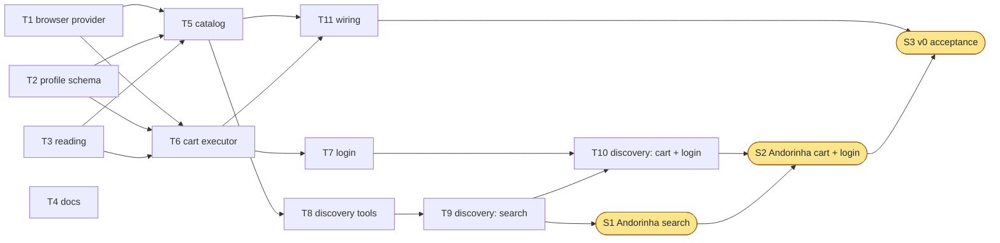

# Shopping Minion — Low-Level Design for the rest of v0

- **Status:** Approved by Johann on 2026-09-30 (drafted by Claude).
- **Scope:** what is missing for v0 ([HLD §1](hld.md#1-goal)): searching the store, the discovery agent, login, the cart, and wiring them into the app. What is already built is listed in `CLAUDE.md`.
- **Rules it follows:** [ADR-0012](adr/0012-the-store-is-used-through-its-site-in-a-browser.md) (the store is used through its site, in a browser, as a user would), [ADR-0006](adr/0006-discovery-agent-writes-site-profile.md), [ADR-0005](adr/0005-model-decides-executor-acts.md).

Johann's answers to the design questions are in [§8](#8-questions).

## 1. What is missing

| Piece | Interface it must satisfy (already in the code) |
|---|---|
| Catalog | `Catalog.search(query) -> list[Candidate]` (`workflow.py`) |
| Cart executor | `CartExecutor.add_to_cart(candidate, sale) -> CartLine` (`workflow.py`), raising `SiteChangedError` |
| Site profile | none yet |
| Discovery agent | none yet |
| Wiring | `default_services()` (`services.py`) currently refuses to start a run |

## 2. Design

### 2.1 How this is tested

There is no fake store (Johann, 2026-09-30). Two kinds of tests:

- **Pure code** (profile schema, reading results into `Candidate`s, quantity rules): unit tests with small samples written in the test files. These run by default.
- **Browser-driven code** (catalog, cart executor, discovery tools): tests against the real store, **not logged in**, marked `live`. They don't run by default (`uv run pytest -m live`). Adding to the anonymous cart of the real store is harmless (Johann, 2026-09-30), so cart tests need no credentials.

Live tests are slower and can fail because the store changed or is down. A failure there is information about the store, not only about the code.

### 2.2 Browser provider

Two additions to `browser.py`:

- `user_agent`: a regular desktop user agent, set on the context. Default on, from a new `config/browser.yaml` (ADR-0012: the browser runs headless with a regular user agent).
- `storage_state`: load and save the session (cookies) at `.auth/<store>.json`, which is git-ignored, so a login survives between runs.

### 2.3 Site profile: user steps

`profiles/<store>/profile.yaml`, validated by Pydantic. It describes what a user does and where to read what the site shows. Sketch:

```yaml
store: andorinha
version: 1
base_url: https://andorinhaonline.com.br/
search:
  steps:                       # what a user does to search
    - open: "{base_url}busca/{query}"      # or: fill a selector, press Enter
  results:
    wait_for: "text=/Encontramos \\d+ ite/"
    from_response:             # preferred: a response the page itself received
      url_matches: "/search\\?"            # a pattern to recognise it, never a URL to call
      items: hits
      fields: { id: id, name: name, brand: brandName, price: pricing.promotionalPrice, in_stock: quantity.inStock }
      unit_of_sale: { weight_when: {path: saleUnit, equals: [KG]}, step_g: {path: quantity.fraction, scale: 1000}, pack_size: {path: name, regex: "(?:c/|lv)\\s*(\\d+)"} }
    from_dom:                  # fallback
      item: "[data-test=product-card]"
      fields: { name: ".name", price: ".price" }
    from_script: null          # last resort: JavaScript that returns the items from the app's store
login:   { steps: [...], logged_in_when: "..." }        # section 2.6
cart:    { add: [...], read: {...}, remove: [...] }      # section 2.5
```

The values above are an illustration of the format, from what was seen on 2026-09-30. The real profile is written by discovery (§2.7), not by hand.

Rules the schema enforces:
- no URL to call other than pages under `base_url`;
- `url_matches` is a pattern for recognising a response, and may not contain a host, ids or a query string to send;
- no credentials, cookies or tokens anywhere.

### 2.4 Catalog (`catalog/browser_catalog.py`)

`BrowserCatalog(profile, context).search(query)`:

1. Start listening to the page's responses.
2. Run `search.steps` with the query.
3. Wait for `wait_for` (or a timeout).
4. Read the results: `from_response` if a matching response arrived, else `from_dom`, else `from_script`.
5. Map items to `Candidate` (field map and unit-of-sale rules), rank, cap at 20.

Failures:
- no results source worked, or a field that the profile requires is missing → `SiteChangedError`;
- the page shows zero results → an empty list (the workflow reports `NOT_FOUND`).

The parsing (field map, unit rules, paths) is pure code with no browser, in `catalog/reading.py`.

### 2.5 Cart executor (`executor/browser_cart.py`)

`BrowserCartExecutor(profile, context).add_to_cart(candidate, sale)`:

1. If the run is for an account, make sure the session is logged in (§2.6). The cart also works without login.
2. Find the product the way a user would: search for its name, locate the card whose id or name matches the candidate.
3. Click add, then step the quantity to `sale.steps_or_units` (clicks on the stepper, or typing in the quantity field, as the profile says).
4. Read the cart back (same three sources as search) and check the line: product and quantity.
5. Return `CartLine(verified=True)`.

Rules:
- never navigate to, or click, anything the profile lists under `checkout_markers` (checkout, payment), and never outside the profile's steps;
- a missing element, or a cart that doesn't match after the add → `SiteChangedError` (the workflow stops and asks for rediscovery);
- an item already in the cart is set to the target quantity, not added twice.

### 2.6 Login

A separate step, used when the cart should be the user's own. If `logged_in_when` isn't true on the page:

1. Run `login.steps`, filling `STORE_EMAIL` and `STORE_PASSWORD` from the environment (dotenvx). Values are never logged.
2. If the site asks for something the profile doesn't cover (captcha, a code by e-mail or SMS), stop with a clear error: the user logs in once in a visible browser (`shopping-minion login <store>`), and the saved session is reused.
3. Save the session to `.auth/<store>.json`.

### 2.7 Discovery agent

A LangGraph agent with browser tools, run by a person, in two sessions:

| Session | Learns | Needs |
|---|---|---|
| 1. Search | `search` section | nothing (no login) |
| 2. Login and cart | `login` and `cart` sections | store credentials, Johann watching |

Tools, all user actions or observations:

- `open_page`, `read_page`, `inspect(selector)`, `click`, `type_text`: as a user would, on the store's domain only.
- `page_responses()`: what the page received after the last action (URL path, status, a preview of the JSON). Observation only; the agent has no tool that sends a request.
- `try_profile(section_yaml, query)`: runs the real catalog (or the cart executor's read step) with a draft and returns the candidates or the error.
- `submit_profile(section_yaml)`: runs it for every test query; all must return sensible results.
- Session 2 only: `login()` (credentials injected by the tool, never shown to the model), `add_test_item()` and `remove_test_item()` (the only cart writes, through the draft profile), `read_cart()`.

Guardrails in code: domain check on navigation, refusal of anything matching checkout or payment, refusal to type into credential or address fields, a step limit, and every tool result logged.

Output: `profiles/<store>/profile.yaml` and recorded fixtures for the adapter's regression tests. A person reviews the profile before it is used.

If the agent can't produce a working profile, the run stops and reports why. **Nobody writes the profile by hand to get past it.**

### 2.8 Wiring

- `default_services()` builds `BrowserCatalog`, the configured resolver backend, and `BrowserCartExecutor`, inside one browser session for the whole run.
- Runs add to the real cart by default: without login it is an anonymous cart. A `--dry-run` option decides without adding.
- The report's "rediscovery needed" message says which command to run.
- CLI: `discover <store> [--part search|cart]`, `login <store>`, `search <store> <query>`.

## 3. Tasks

Each task is small enough for one agent with a clean context. Every brief given to an agent follows the template in §6.

| # | Task | Depends on | Files it may touch | Done when |
|---|---|---|---|---|
| **T1** | Browser provider: user agent and session storage | none | `src/.../browser.py`, `config/browser.yaml`, `tests/test_browser.py` | A test shows the configured user agent is what the browser reports; a session saved in one context is present in the next. Live: the store's search page shows results in headless mode. |
| **T2** | Profile schema (user steps) | none | `src/.../catalog/profile.py`, `tests/test_profile.py` (shared models are in `catalog/mapping.py`) | The §2.3 example validates; the three rules of §2.3 are rejected with clear errors. |
| **T3** | Reading results (pure) | none | `src/.../catalog/reading.py`, `tests/test_reading.py` | From a JSON payload and from an HTML string to `Candidate`s, with unit, pack and weight-step cases, tested without a browser. |
| **T4** | Docs alignment | none | `docs/hld.md`, `README.md` | HLD §4.5 and §9 match ADR-0013 (once accepted); README describes the commands that exist. |
| **T5** | Catalog | T1, T2, T3 | `src/.../catalog/browser_catalog.py`, `tests/test_browser_catalog.py` | Written to §2.4, with unit tests for anything that doesn't need a page. Not run against the store before S1 (§8, question 6). |
| **T6** | Cart executor (anonymous cart) | T1, T2, T3 | `src/.../executor/browser_cart.py`, `tests/test_browser_cart.py` | Written to §2.5, unit tests for pure parts only; first run against the store in S2 (§8, question 6). Target behaviour: adds by unit and by weight step, verifies the cart, sets (not doubles) an existing line, refuses a step marked as checkout, raises `SiteChangedError` when an element is missing. |
| **T7** | Login | T6 | `src/.../executor/login.py`, `cli.py` (login), tests | Session saved and reused; clear stop when the site asks for something the profile doesn't cover. Verified only in S2. |
| **T8** | Discovery tools | T2, T5 | `src/.../discovery/tools.py`, `tests/test_discovery_tools.py` | Guardrails unit-tested; live: each tool works on the real store, not logged in; no tool can send a request of its own. |
| **T9** | Discovery agent, session 1 (search) | T8 | `src/.../discovery/agent.py`, `cli.py` (discover) | The agent loop runs with a scripted fake model (no cost) and writes a profile file from what the script submits. |
| **T10** | Discovery, session 2 (cart and login) | T6, T7, T9 | `src/.../discovery/`, `cli.py` | Same, for the `cart` and `login` sections. |
| **T11** | Wiring and CLI | T5, T6 | `services.py`, `cli.py`, `web/`, tests | `default_services()` builds the real catalog and executor; the web flow runs with stubs in the default tests; `--dry-run` works. |
| **S1** | Discover Andorinha's search | T9 | `profiles/andorinha/` | **Supervised by Johann**, paid model. The agent's profile returns sensible candidates for the three v0 items; the catalog's live tests pass with it. |
| **S2** | Discover Andorinha's cart and login | T10, S1 | `profiles/andorinha/` | **Supervised by Johann.** Anonymous cart first: a test item is added, read back and removed. Then login, with his credentials. |
| **S3** | v0 acceptance | T11, S2 | none | **Supervised by Johann.** One real photo, three items, a correct cart and report. |

Not in these tasks: calibrating the confidence thresholds (needs more eval cases and model credit), and anything from v1.

## 4. Order and parallel work



| Wave | In parallel | Then |
|---|---|---|
| 1 | T1, T2, T3, T4 | review and merge |
| 2 | T5, T6 | review and merge |
| 3 | T7, T8, T11 | review and merge |
| 4 | T9 | review; then S1 with Johann |
| 5 | T10 | review; then S2 and S3 with Johann |

Tasks in the same wave touch different files, so each runs in its own git worktree and merges without conflicts. `cli.py` is touched by T7, T9, T10 and T11: T7 and T11 are in the same wave, so T11 adds only the run options and T7 only the `login` command, in separate functions.

**Who runs them** (Johann, 2026-09-30): sub-agents in worktrees, one per task, on Sonnet 5.5, reviewed by Johann after each wave.

## 5. Checkpoints

Work stops for Johann's review:

- after each wave, before merging;
- at S1, S2 and S3, which he runs or watches;
- whenever a task's agent meets one of the stop conditions in §6.

Costs: no task before S1 calls a paid model (T9 and T10 use a scripted fake model). Live tests open the real store, not logged in, a few pages per test. Paid model calls happen in S1, S2 and S3, through OpenRouter.

## 6. Brief template for a task agent

```text
Task: <id and title>
Read first: CLAUDE.md, docs/lld.md §<sections>, ADR-0012, <other ADRs>.
Goal: <one paragraph>
You may touch: <files>
Don't touch: anything else. Don't edit docs/adr/, docs/hld.md, docs/lld.md or CLAUDE.md.
Done when: <the task's acceptance, as tests that pass>
Verify with: uv run ruff check . && uv run pytest
Stop and report, without working around it, if:
- the task seems to need a request to the store's endpoints, or a new flag or exception to a guardrail;
- the task contradicts an ADR or this LLD;
- you need a real store, a credential or a paid model call;
- the acceptance can't be met as written.
Report: what you built, what you verified and how, what you didn't verify, and any assumption you made.
Commit on your branch. Don't push.
```

## 7. Risks

- **The profile format may not fit what discovery finds** on a real site. T2 keeps it small; S1 is the first real test, and a format change after S1 goes back through T2, T3 and T5.
- **Without a fake store, browser-driven code is only verified against the real site.** Tests depend on the store being up and unchanged, and whatever isn't covered before S1 gets debugged during a supervised session.
- **Login may need a captcha or a code.** The design then falls back to a one-time manual login (§2.6). Unknown until S2.
- **Finding a product again to add it** (§2.5, step 2) depends on the site's search returning it for its own name. If not, the profile needs another way to reach a product; unknown until S2.
- **The discovery agent failed on its first attempts** (different approach, since removed). Whether it succeeds under ADR-0012 is what S1 tests.

## 8. Questions

### Resolved (Johann, 2026-09-30)

| # | Question | Decision |
|---|---|---|
| 1 | May the profile hold a path pattern (`url_matches`) to recognise the response with the results? | Yes. |
| 2 | A fake store as the test bed? | No. Dropped entirely for now. |
| 3 | Which model provider for discovery? | OpenRouter. Johann added credit on 2026-09-30 (about US$ 9) and gave the go-ahead. |
| 4 | Who runs the tasks? | Sub-agents in worktrees, on Sonnet 5.5. |
| 5 | `--dry-run` by default? | No. Using the real cart while not logged in is harmless. |
| 6 | How are the catalog (T5) and the cart executor (T6) verified before discovery has produced a profile? | They aren't. They are written and reviewed by reading, with unit tests for their pure parts only, and run against the store for the first time in S1 and S2. No test-only profile is written by hand. |
